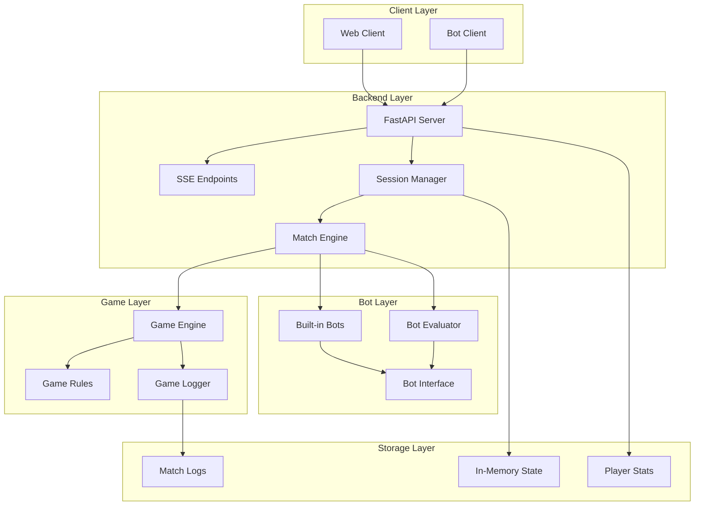

# Spellcasters Playground Backend - Technical Design

## Overview

The Spellcasters Playground Backend is a FastAPI-based real-time multiplayer bot battle system designed for hackathon environments. The system enables participants to register, submit Python bots, and engage in turn-based matches with live streaming via Server-Sent Events (SSE). The backend integrates with the existing game engine while providing comprehensive match logging, replay functionality, and secure bot code execution.

### Key Design Principles

- **Real-time Communication**: SSE-based streaming for live match updates
- **Security First**: Restricted bot code execution and input validation
- **Scalability**: Support for concurrent matches using asyncio
- **Integration**: Seamless integration with existing game engine
- **Incremental Development**: Each component builds on previous implementations

## Architecture

### High-Level Architecture



### Technology Stack

- **Framework**: FastAPI 0.104+ with async/await support
- **Real-time**: Server-Sent Events (SSE) via StreamingResponse
- **Concurrency**: asyncio for session management
- **Security**: Restricted execution sandbox for bot code
- **Validation**: Pydantic models for request/response validation
- **Game Engine**: Integration with existing `/game` directory components
- **Logging**: Structured logging with session context

## Components and Interfaces

### 1. Player Registration System

#### Data Models

```python
class PlayerRegistration(BaseModel):
    player_name: str = Field(..., min_length=1, max_length=50)
    submitted_from: Literal["pasted", "upload"] = "pasted"

class Player(BaseModel):
    player_id: str = Field(..., description="UUID string")
    player_name: str
    submitted_from: str
    total_matches: int = 0
    wins: int = 0
    losses: int = 0
    draws: int = 0
    created_at: datetime
```

#### API Endpoints

```python
@app.post("/players/register", response_model=PlayerRegistrationResponse)
async def register_player(registration: PlayerRegistration) -> PlayerRegistrationResponse:
    """Register a new player and return generated player_id"""
```

#### Storage Design

- **In-Memory Storage**: Dictionary-based player registry
- **Thread Safety**: asyncio locks for concurrent access
- **Data Persistence**: Players stored for session duration
- **Statistics Tracking**: Real-time win/loss/draw updates

### 2. Session Management System

#### Session State Model

```python
class SessionState(BaseModel):
    session_id: str
    player_1: PlayerSlot
    player_2: PlayerSlot
    current_game_state: Dict[str, Any]
    match_log: List[str]
    turn_index: int
    status: SessionStatus
    created_at: datetime
    last_activity: datetime

class PlayerSlot(BaseModel):
    player_id: Optional[str]  # None for built-in bots
    bot_instance: Optional[BotInterface]
    connection_handle: Optional[str]  # SSE connection ID
    is_builtin: bool = False
```

#### Session Manager Component

```python
class SessionManager:
    def __init__(self):
        self.sessions: Dict[str, SessionState] = {}
        self.match_loops: Dict[str, asyncio.Task] = {}
        self.sse_connections: Dict[str, List[SSEConnection]] = {}
    
    async def create_session(self, player_configs: List[PlayerConfig]) -> str
    async def start_match_loop(self, session_id: str) -> None
    async def add_sse_connection(self, session_id: str, connection: SSEConnection) -> None
    async def submit_action(self, session_id: str, player_id: str, action: PlayerAction) -> None
    async def cleanup_session(self, session_id: str) -> None
```

### 3. Real-time Match Streaming (SSE)

#### SSE Event Models

```python
class SSETurnEvent(BaseModel):
    event: Literal["turn_update"] = "turn_update"
    turn: int
    game_state: Dict[str, Any]
    actions: List[PlayerActionResult]
    events: List[str]
    log_line: str

class SSEGameOverEvent(BaseModel):
    event: Literal["game_over"] = "game_over"
    winner: Optional[str]
    final_state: Dict[str, Any]
    match_summary: MatchSummary
```

#### SSE Implementation

```python
async def stream_match_events(session_id: str, request: Request) -> StreamingResponse:
    """Stream real-time match events via SSE"""
    
    async def event_generator():
        connection = SSEConnection(session_id, request)
        try:
            await session_manager.add_sse_connection(session_id, connection)
            
            while not await request.is_disconnected():
                event = await connection.wait_for_event(timeout=30.0)
                if event:
                    yield f"data: {event.json()}\n\n"
                else:
                    # Heartbeat
                    yield "data: {\"event\": \"heartbeat\"}\n\n"
                    
        except asyncio.CancelledError:
            await session_manager.remove_sse_connection(session_id, connection)
    
    return StreamingResponse(
        event_generator(),
        media_type="text/event-stream",
        headers={
            "Cache-Control": "no-cache",
            "Connection": "keep-alive",
            "X-Accel-Buffering": "no"  # Nginx optimization
        }
    )
```

### 4. Game Engine Integration

#### Game Engine Adapter

```python
class GameEngineAdapter:
    """Adapter between backend and existing game engine"""
    
    def __init__(self):
        self.engine = None
    
    def initialize_match(self, bot1: BotInterface, bot2: BotInterface) -> GameEngine:
        """Initialize game engine with bot instances"""
        
    def execute_turn(self, actions: List[PlayerAction]) -> TurnResult:
        """Execute a single turn with player actions"""
        
    def get_game_state(self) -> Dict[str, Any]:
        """Get current game state for SSE streaming"""
        
    def check_game_over(self) -> Optional[GameResult]:
        """Check if game has ended and return result"""
```

#### Integration Modifications

- **Async Compatibility**: Modify game engine to support async operation
- **State Extraction**: Add methods to extract game state for SSE streaming
- **Action Validation**: Integrate backend action validation with game rules
- **Logging Integration**: Connect game logger with match logging system

### 5. Built-in Bot System

#### Bot Interface Standardization

```python
class BotInterface(ABC):
    """Standardized interface for all bots (built-in and player)"""
    
    @property
    @abstractmethod
    def name(self) -> str:
        """Bot identification name"""
    
    @property
    def player_id(self) -> str:
        """Unique player ID for backend tracking"""
    
    @abstractmethod
    def decide(self, state: Dict[str, Any]) -> Dict[str, Any]:
        """Main decision method called by game engine"""
    
    @property
    def is_builtin(self) -> bool:
        """Flag indicating if this is a built-in bot"""
        return False
```

#### Built-in Bot Registry

```python
class BuiltinBotRegistry:
    """Registry and factory for built-in bots"""
    
    BUILTIN_BOTS = {
        "sample_bot_1": {
            "name": "Sample Bot 1",
            "player_id": "builtin_sample_1",
            "class": SampleBot1,
            "difficulty": "easy"
        },
        "tactical_bot": {
            "name": "Tactical Bot",
            "player_id": "builtin_tactical",
            "class": TacticalBot,
            "difficulty": "medium"
        }
    }
    
    @classmethod
    def create_bot(cls, bot_id: str) -> BotInterface:
        """Create built-in bot instance"""
    
    @classmethod
    def list_available_bots(cls) -> List[BotInfo]:
        """List all available built-in bots"""
```

### 6. Player Action Processing

#### Action Models

```python
class PlayerAction(BaseModel):
    player_id: str
    turn: int
    action: ActionData

class ActionData(BaseModel):
    move: Optional[List[int]] = None  # [dx, dy]
    spell: Optional[SpellAction] = None

class SpellAction(BaseModel):
    name: str
    target: Optional[List[int]] = None  # [x, y] for targeted spells
```

#### Turn Processing Pipeline

```python
class TurnProcessor:
    """Processes player actions and coordinates turn execution"""
    
    def __init__(self, timeout_seconds: float = 5.0):
        self.timeout = timeout_seconds
        self.pending_actions: Dict[str, Dict[str, PlayerAction]] = {}
    
    async def collect_actions(self, session_id: str, expected_players: List[str]) -> Dict[str, PlayerAction]:
        """Collect actions from all players with timeout"""
    
    async def validate_action(self, action: PlayerAction, game_state: Dict[str, Any]) -> bool:
        """Validate action against current game rules"""
    
    async def process_turn(self, session_id: str, actions: Dict[str, PlayerAction]) -> TurnResult:
        """Process complete turn with all player actions"""
```

### 7. Security and Bot Code Evaluation

#### Restricted Execution Sandbox

Based on research into Python security practices, we'll implement a multi-layered security approach:

```python
class BotCodeEvaluator:
    """Secure evaluation of player-submitted bot code"""
    
    def __init__(self):
        self.restricted_builtins = {
            'abs', 'bool', 'dict', 'float', 'int', 'len', 'list', 
            'max', 'min', 'range', 'str', 'sum', 'tuple'
        }
        self.timeout_seconds = 2.0
        self.memory_limit_mb = 50
    
    async def evaluate_bot_code(self, code: str, context: Dict[str, Any]) -> Any:
        """Safely evaluate bot code with restrictions"""
        
        # 1. Static analysis of code
        ast_tree = ast.parse(code)
        self._validate_ast(ast_tree)
        
        # 2. Create restricted environment
        restricted_globals = {
            '__builtins__': {k: __builtins__[k] for k in self.restricted_builtins}
        }
        
        # 3. Execute with timeout and resource limits
        return await self._execute_with_limits(code, restricted_globals, context)
    
    def _validate_ast(self, tree: ast.AST) -> None:
        """Validate AST for dangerous operations"""
        # Check for imports, exec, eval, etc.
        
    async def _execute_with_limits(self, code: str, globals_dict: Dict, locals_dict: Dict) -> Any:
        """Execute code with timeout and memory limits"""
        # Use asyncio with subprocess for isolation
```

#### Security Measures Implementation

1. **AST Validation**: Check for dangerous operations before execution
2. **Restricted Builtins**: Limited set of available built-in functions
3. **Timeout Enforcement**: Maximum execution time per bot decision
4. **Memory Limits**: Resource constraints on bot execution
5. **Subprocess Isolation**: Execute bot code in separate processes
6. **Input Sanitization**: Validate all user inputs before processing

## Data Models

### Core Database Schema

While the system uses in-memory storage, here are the logical data models:

```python
# Player Management
players: Dict[str, Player] = {}

# Session State
sessions: Dict[str, SessionState] = {}

# Match Logs (File-based)
# logs/playground/{session_id}.log

# SSE Connections
sse_connections: Dict[str, List[SSEConnection]] = {}
```

### State Management

```python
class StateManager:
    """Centralized state management for all backend components"""
    
    def __init__(self):
        self.players = PlayerRegistry()
        self.sessions = SessionRegistry()
        self.connections = SSEConnectionManager()
    
    async def cleanup_expired_sessions(self) -> None:
        """Periodic cleanup of inactive sessions"""
    
    async def get_system_stats(self) -> SystemStats:
        """Get current system statistics"""
```

## Error Handling

### Error Hierarchy

```python
class PlaygroundError(Exception):
    """Base exception for all playground errors"""
    
class SessionNotFoundError(PlaygroundError):
    """Session does not exist"""
    
class InvalidActionError(PlaygroundError):
    """Player action is invalid"""
    
class BotExecutionError(PlaygroundError):
    """Error in bot code execution"""
    
class TimeoutError(PlaygroundError):
    """Operation timed out"""
```

### Error Response Models

```python
class ErrorResponse(BaseModel):
    error: str
    message: str
    details: Optional[Dict[str, Any]] = None
    session_id: Optional[str] = None
```

### Global Error Handlers

```python
@app.exception_handler(SessionNotFoundError)
async def session_not_found_handler(request: Request, exc: SessionNotFoundError):
    return JSONResponse(
        status_code=404,
        content=ErrorResponse(
            error="SESSION_NOT_FOUND",
            message="The requested session does not exist"
        ).dict()
    )

@app.exception_handler(BotExecutionError)
async def bot_execution_error_handler(request: Request, exc: BotExecutionError):
    # Log security incident
    logger.warning(f"Bot execution error: {exc}", extra={"security": True})
    return JSONResponse(
        status_code=400,
        content=ErrorResponse(
            error="BOT_EXECUTION_ERROR",
            message="Error executing bot code"
        ).dict()
    )
```

## Testing Strategy

### Unit Testing

```python
# Test structure
tests/
├── unit/
│   ├── test_player_registration.py
│   ├── test_session_manager.py
│   ├── test_bot_evaluator.py
│   ├── test_game_engine_adapter.py
│   └── test_sse_streaming.py
├── integration/
│   ├── test_full_match_flow.py
│   ├── test_builtin_bots.py
│   └── test_concurrent_sessions.py
└── security/
    ├── test_bot_sandbox.py
    ├── test_input_validation.py
    └── test_timeout_enforcement.py
```

### Testing Frameworks and Tools

- **pytest**: Primary testing framework
- **pytest-asyncio**: For async test support
- **httpx**: For API endpoint testing
- **websockets**: For SSE connection testing
- **mock**: For component isolation
- **coverage**: Code coverage measurement

### Test Categories

1. **Unit Tests**: Individual component testing
2. **Integration Tests**: Full workflow testing
3. **Security Tests**: Bot sandbox and input validation
4. **Performance Tests**: Concurrent session handling
5. **Regression Tests**: Ensure existing functionality

### Mock Strategies

```python
# Mock built-in bots for testing
class MockBot(BotInterface):
    def __init__(self, name: str, decisions: List[Dict]):
        self._name = name
        self.decisions = iter(decisions)
    
    def decide(self, state: Dict[str, Any]) -> Dict[str, Any]:
        return next(self.decisions, {"move": [0, 0], "spell": None})

# Mock SSE connections
class MockSSEConnection:
    def __init__(self, session_id: str):
        self.session_id = session_id
        self.events = asyncio.Queue()
    
    async def send_event(self, event: Dict) -> None:
        await self.events.put(event)
```

## Security Considerations

### Bot Code Execution Security

1. **Sandboxing**: Execute bot code in restricted environment
2. **Timeout Enforcement**: Prevent infinite loops and CPU burning
3. **Memory Limits**: Restrict memory usage per bot
4. **AST Validation**: Check code structure before execution
5. **Process Isolation**: Use subprocess for critical isolation

### Input Validation

1. **Request Validation**: Pydantic models for all inputs
2. **SQL Injection Prevention**: Parameterized queries (if database used)
3. **XSS Prevention**: HTML escaping for any displayed content
4. **Rate Limiting**: Prevent abuse of endpoints

### Session Security

1. **Session Isolation**: Separate session state per match
2. **Connection Management**: Proper SSE connection cleanup
3. **Access Control**: Validate player permissions for actions
4. **Audit Logging**: Log all security-relevant events

### Infrastructure Security

1. **CORS Configuration**: Restrict cross-origin requests
2. **HTTPS Only**: Force secure connections in production
3. **Header Security**: Implement security headers
4. **Resource Limits**: Prevent DoS via resource exhaustion

## Performance Optimization

### Concurrency Design

- **AsyncIO**: Non-blocking I/O for all operations
- **Connection Pooling**: Efficient SSE connection management
- **Task Queues**: Background processing for heavy operations
- **Batch Processing**: Group operations where possible

### Memory Management

- **Session Cleanup**: Automatic cleanup of expired sessions
- **Connection Limits**: Maximum concurrent SSE connections
- **Data Structures**: Efficient data structures for state storage
- **Garbage Collection**: Explicit cleanup of large objects

### Monitoring and Metrics

```python
class MetricsCollector:
    """Collect system performance metrics"""
    
    def __init__(self):
        self.active_sessions = 0
        self.total_matches = 0
        self.sse_connections = 0
        self.bot_execution_times = []
    
    async def record_match_completion(self, duration: float) -> None:
        """Record match completion metrics"""
    
    async def get_health_status(self) -> HealthStatus:
        """Get current system health"""
```

## Implementation Plan

### Phase 1: Core Infrastructure (Increment 1)
- FastAPI application setup
- Player registration system
- Basic session management
- In-memory storage implementation

### Phase 2: Game Engine Integration (Increment 2)
- Game engine adapter
- Built-in bot system
- Basic turn processing
- Game state management

### Phase 3: Real-time Streaming (Increment 3)
- SSE endpoint implementation
- Event streaming system
- Connection management
- Basic error handling

### Phase 4: Player Actions (Increment 4)
- Action submission endpoints
- Turn synchronization
- Timeout handling
- Action validation

### Phase 5: Security and Bot Evaluation (Increment 5)
- Bot code sandbox
- Security validation
- Resource limits
- Input sanitization

### Phase 6: Logging and Replay (Increment 6)
- Match logging system
- Replay functionality
- Statistics tracking
- File management

### Phase 7: Testing and Optimization (Increment 7)
- Comprehensive test suite
- Performance optimization
- Security hardening
- Documentation completion

Each increment will be fully testable and provide incremental value, allowing for validation and feedback at each stage.

## Development Guidelines

### Code Organization

```
backend/
├── app/
│   ├── __init__.py
│   ├── main.py              # FastAPI application
│   ├── api/
│   │   ├── __init__.py
│   │   ├── players.py       # Player endpoints
│   │   ├── sessions.py      # Session endpoints
│   │   └── streaming.py     # SSE endpoints
│   ├── core/
│   │   ├── __init__.py
│   │   ├── config.py        # Configuration
│   │   ├── security.py      # Security utilities
│   │   └── exceptions.py    # Custom exceptions
│   ├── models/
│   │   ├── __init__.py
│   │   ├── players.py       # Player models
│   │   ├── sessions.py      # Session models
│   │   └── events.py        # SSE event models
│   ├── services/
│   │   ├── __init__.py
│   │   ├── session_manager.py
│   │   ├── bot_evaluator.py
│   │   └── game_adapter.py
│   └── utils/
│       ├── __init__.py
│       ├── logging.py
│       └── validation.py
├── tests/
├── logs/
└── requirements.txt
```

### Code Quality Standards

- **Type Hints**: Full type annotation for all functions
- **Documentation**: Comprehensive docstrings
- **Linting**: Black formatting and pylint compliance
- **Testing**: Minimum 80% code coverage
- **Security**: Regular security reviews

This design provides a comprehensive foundation for implementing the spellcasters-playground-backend with proper security, scalability, and maintainability considerations. 