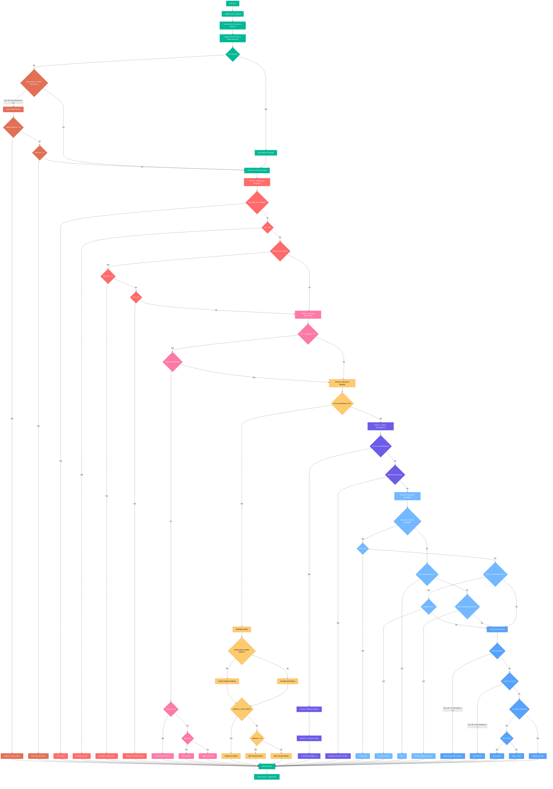

# Kevin Link Bot Strategy: Tactical Combat System

## Core Principles & State Tracking

Kevin Link is a tactical wizard bot that employs sophisticated state tracking and decision-making to outmaneuver opponents. The bot maintains:

- **Dynamic State Tracking**: Monitors own/opponent HP, mana, cooldowns, positions, shield status, active minions, and artifacts
- **Movement Pattern Analysis**: Tracks both opponent and self-movement patterns for better prediction and positioning
- **Game Phase Awareness**: Implements distinct strategies for early game (turns 1-10) and late game (11+)

## Decision Priority Hierarchy

The bot follows a strict decision priority system:

1. **First-Turn Shield**: Always attempts to shield on first turn
   - Provides early protection against aggressive opponents
   - Enables safer positioning in early game

2. **Early Artifact Racing** (Turns 1-3)
   - Teleports or blinks to high-value health or mana artifacts if HP ≤ 60 or mana ≤ 40
   - Avoids cooldown artifacts when not needed
   - Prioritizes mana artifacts when mana < 60 and health artifacts when HP < 60 during early race

3. **Emergency Response** (`_emergency_response`)
   - Shield if HP ≤ 60 and not already shielded
   - Emergency heal when HP ≤ 30
   - Emergency blink when opponent distance ≤ 3
   - Emergency teleport to nearest health artifact when HP ≤ 35 (correctly references available artifacts)

4. **Offensive Opportunity** (`_offensive_opportunity`)
   - Fireball when opponent is in range (≤ 5) and not shielded
   - Melee attack when adjacent to opponent
   - Aggressive blink to close distance when healthy

5. **Resource Acquisition** (`_resource_strategy`)
   - Trigger when HP ≤ 50 or mana ≤ 40
   - Teleport to critical health or mana artifacts; avoid teleporting to cooldown artifacts unless no other options
   - Blink toward resource artifacts when distance > 1
   - Move toward weighted best artifact with lower preference for cooldown artifacts to conserve mana

6. **Minion Management**
   - Summon first minion by turn 2
   - Position minions at least 2 squares away diagonally, avoiding board edges (1-8 range)
   - Maintain safe distance between wizard and minions to prevent collisions
   - Favor positions that maximize distance from opponent

7. **Positional Advantage** (`_positional_advantage`)
   - Proactive shielding when opponent is within range (≤ 5), but only 10% likelihood to conserve mana
   - Healing when moderately damaged and not under immediate threat
   - Blink to maintain optimal combat distance

8. **Movement Strategy** (`_calculate_move`)
   - Prioritize artifact collection when resources are low
   - Defensive retreat when low health
   - Maintain optimal distance based on situation
   - Intelligent strafing to avoid predictable movement patterns

## Helper Strategies & Algorithms

- **`_calculate_optimal_distance`**: Dynamically determines ideal spacing
  - 7 units when at very low health
  - 6 units when low health without shield
  - 5 units when fireball ready and opponent not shielded
  - 3 units when shielded and healthy
  - 5 units as default

- **`_safe_retreat_direction`**: Enhanced evasion calculation
  - Higher weights for distance from primary threat (4x) and secondary threats (1.5x)
  - Precisely calculates perpendicularity using vector math and dot products
  - Strong penalty for moving directly toward threats (-10)
  - Significant bonus for perpendicular movement (+5)
  - Heavily penalizes board edges (-10) and corners (-20)
  - Prefers diagonal movement for faster escape (+2)
  - Includes randomization to reduce predictability
  - Penalizes repeating previous movement patterns

- **`_intelligent_strafe`**: Improved lateral movement system
  - Prefers perpendicular movement to main axis of distance
  - Stronger penalties for moving near board edges (-30) and corners (-50)
  - Higher penalty for moving near own minions (-50) to avoid collisions
  - Considers proximity to valuable artifacts
  - Includes diagonal movements in fallback options
  - Uses increased randomization to avoid predictable patterns

- **`_direction_toward`**: Optimized for blink ability
  - Special handling for blink distance (typically 2 spaces)
  - Maximizes blink range using Manhattan distance calculation
  - Ensures moves stay within blink's 4-cell range limit
  - Improved boundary adjustment logic
  - Dynamic direction calculation based on target position

- **`_predict_position`**: Anticipates opponent movement
  - Analyzes consistent movement patterns
  - Predicts likely next position for targeting
  - Ensures predictions stay within board boundaries

- **`_choose_best_artifact`**: Sophisticated artifact evaluation
  - Scores artifacts based on current needs (health/mana)
  - Considers distance and risk of collection
  - Evaluates whether opponent might reach artifact first
  - Adjusts value based on game phase

- **`_calculate_move_toward_artifact`**: Improved resource targeting
  - Properly factors in current HP and mana for better prioritization
  - Falls back to conservative estimation when health/mana unknown
  - Integrates with general movement system for consistent behavior

By combining these strategic elements, Kevin Link employs consistent tactical decision-making with enhanced positional awareness, making it a formidable and unpredictable wizard in the arena.

## Decision Flow Visualization

The following flowchart illustrates the complete decision-making process of the Kevin Link bot:

This flowchart demonstrates the sophisticated decision-making hierarchy that makes Kevin Link a formidable tactical wizard, with each priority level building upon comprehensive state analysis and strategic positioning.