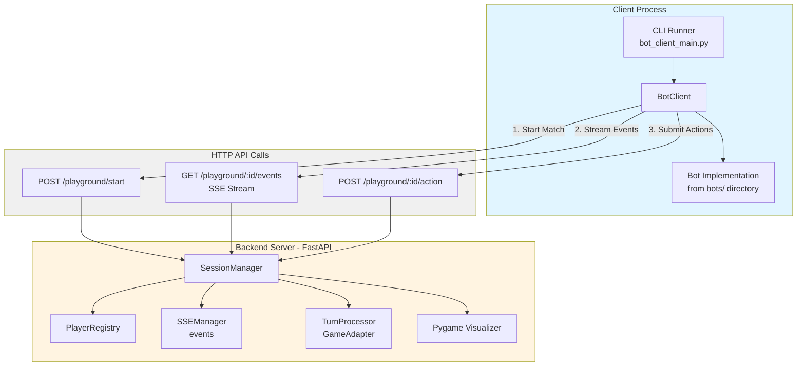
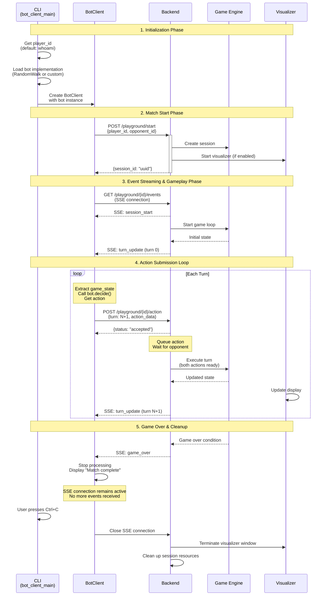
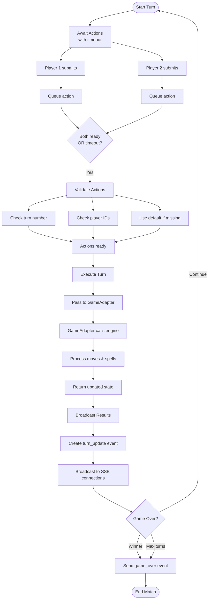
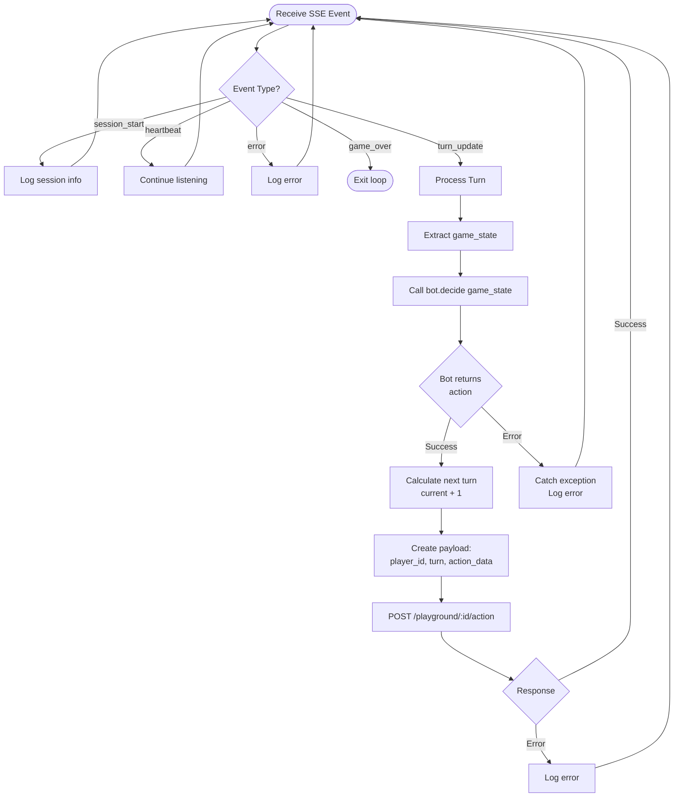

# Client Bot Integration Design Document

## 1. Overview

### 1.1 Purpose

This document details the technical design for enabling remote bot clients to play Spellcasters matches against the backend server via HTTP/SSE communication. The feature provides a client library and CLI tool that allows bot developers to:
- Use existing player identities (or OS username by default)
- Start matches against builtin bots or other remote players
- Receive real-time game events via Server-Sent Events (SSE)
- Submit bot actions automatically during gameplay
- Load and use existing `BotInterface` implementations dynamically
- Properly clean up resources when matches end

### 1.2 Design Goals

1. **Ease of Use**: Simple CLI tool with sensible defaults (OS username, random bot)
2. **Bot Compatibility**: Dynamic loading of existing `BotInterface` implementations
3. **Resilient Communication**: Automatic SSE reconnection and error handling
4. **Event-Driven**: React to game events and submit actions in real-time
5. **Resource Management**: Proper cleanup of client, server, and visualizer resources
6. **Modern Python**: Async/await throughout, type hints, clean separation of concerns

### 1.3 Related Documents

- Overall functionla specifcaiton: `docs/specs/spellcasters-functional-spec.md`
- Backend design: `docs/specs/spellcasters-backend/design.md`
- Bot Interface: `bots/bot_interface.py`
- Game Engine: `game/engine.py`

---

## 2. Architecture

### 2.1 High-Level Architecture



### 2.2 Component Interaction Flow

**Match Flow Sequence**:



---

## 3. Components and Interfaces

### 3.1 BotClient (`client/bot_client.py`)

The main client library for interacting with the Spellcasters backend.

**Key Methods**:
```python
class BotClient:
    def __init__(self, base_url: str, bot_instance: Any, *, http_client: Optional[httpx.AsyncClient] = None):
        """Initialize with backend URL and bot implementation instance."""
        
    async def start_match(player_id: str, opponent_id: str, visualize: bool = True) -> str:
        """Start a match and return session ID."""
        
    async def stream_session_events(session_id: str, max_events: Optional[int]) -> AsyncIterator[Dict]:
        """Stream SSE events from a session."""
        
    async def submit_action(session_id: str, player_id: str, turn: int, action: Dict) -> None:
        """Submit an action for a turn."""
        
    async def play_match(session_id: str, player_id: str, max_events: Optional[int]) -> AsyncIterator[Dict]:
        """Automatically play a match (stream events + submit actions)."""
```

**Responsibilities**:
- Match creation with backend (player vs player or player vs builtin)
- SSE event streaming via `SSEClient`
- Action submission to backend
- Automated gameplay: calling bot's `decide()` and submitting actions
- Resource cleanup on termination

### 3.2 Bot Implementation Interface

Bot implementations must conform to the `BotInterface` from `bots/bot_interface.py`.

**Interface Requirements**:
```python
class BotInterface:
    @property
    def name(self) -> str:
        """Unique bot identifier."""
        
    def decide(self, state: Dict[str, Any]) -> Dict[str, Any]:
        """Process game state and return action decision.
        
        Args:
            state: Game state containing turn, self, opponent, artifacts, minions
            
        Returns:
            Action dict with format: {"move": [dx, dy], "spell": {...} or None}
        """
```

**Built-in Bot Types**:
- `RandomWalkStrategy`: Simple toggle-based movement for testing (no file loading needed)
- Custom bots: Loaded from `bots/` directory via module path (e.g., `bots.sample_bot1.sample_bot_1.SampleBot1`)

**Design Rationale**: 
- No strategy abstraction layer - bot implementations ARE the strategy
- Client directly calls bot's synchronous `decide()` method
- Bots remain unchanged from existing implementation in `bots/` directory

### 3.3 SSEClient (`client/sse_client.py`)

Low-level SSE client with automatic reconnection.

**Features**:
- Connection management with exponential backoff
- SSE protocol parsing (event/data fields)
- Event type decoding with Pydantic model validation
- Configurable timeouts and retry limits

**Configuration**:
```python
@dataclass
class SSEClientConfig:
    connect_timeout_seconds: float = 5.0
    read_timeout_seconds: float = 30.0
    reconnect_initial_backoff: float = 0.5
    reconnect_max_backoff: float = 8.0
    max_retries: int = 5
```

### 3.4 CLI Runner (`client/bot_client_main.py`)

Command-line interface for running bot matches.

**Features**:
- Uses existing player identities (defaults to OS username via `whoami`)
- Dynamic bot loading from module paths
- Support for random and custom bot implementations
- Matches against builtin bots or remote players
- Fully automated match gameplay
- Configurable logging and event limits
- Proper cleanup on termination

**CLI Arguments**:
- `--base-url`: Backend server URL (default: http://localhost:8000, env: `BASE_URL`)
- `--player-id`: Existing registered player ID (default: OS username via `whoami`, env: `PLAYER_ID`)
- `--opponent-id`: Opponent ID - builtin bot or player (default: `builtin_sample_1`, env: `OPPONENT_ID`)
- `--bot-type`: Bot strategy - `random` or `custom` (default: `random`, env: `BOT_TYPE`)
- `--bot-path`: Module path for custom bots (required if `--bot-type=custom`, env: `BOT_PATH`)
  - Format: `module.path.ClassName`
  - Example: `bots.sample_bot1.sample_bot_1.SampleBot1`
- `--max-events`: Maximum events to process (default: 100, env: `MAX_EVENTS`)
- `--log-level`: Logging level (default: INFO, env: `LOG_LEVEL`)

**Workflow**:
1. Get player_id (from argument or `whoami`)
2. Load bot implementation (RandomWalkStrategy or custom bot from `bots/`)
3. Create BotClient with bot instance
4. Start match against opponent
5. Automatically play match (stream events + submit actions)
6. Display "Match complete. Press Ctrl+C to exit." when game ends
7. Clean up resources on Ctrl+C

---

## 4. Data Models and Protocols

### 4.1 Action Submission Format

```python
{
  "player_id": "uuid-string",
  "turn": 1,
  "action_data": {
    "move": [dx, dy],  # Movement delta, e.g., [1, 0] for right
    "spell": {         # Optional spell action
      "name": "fireball",
      "target": [x, y]  # Optional target position
    }
  }
}
```

### 4.2 Game State Format (from turn_update events)

```python
{
  "event": "turn_update",
  "turn": 1,
  "game_state": {
    "turn": 1,
    "board_size": 15,
    "self": {
      "name": "Player 1",
      "position": [0, 0],
      "hp": 100,
      "mana": 100,
      "cooldowns": {...}
    },
    "opponent": {...},
    "artifacts": [...],
    "minions": [...]
  },
  "actions": [...],
  "events": [...],
  "timestamp": "..."
}
```

### 4.3 SSE Event Types

1. **session_start**: Match initialization with player info and initial state
2. **turn_update**: Turn results with updated game state, actions, and events
3. **game_over**: Match conclusion with winner, final state, and game result
4. **heartbeat**: Keepalive event (every 5 seconds)
5. **error**: Error notification with type and message

---

## 5. Event Processing Lifecycle

### 5.1 Backend Turn Processing



### 5.2 Client Turn Processing



### 5.3 Timing and Synchronization

**Action Collection Window**:
- Backend broadcasts `turn_update` for turn N
- Opens collection window for turn N+1
- Waits up to `TURN_TIMEOUT_SECONDS` (default 5s) for both actions
- If timeout: uses default actions
- Executes turn N+1 and repeats

**Client Timing**:
- Receives `turn_update` for turn N
- Must submit action for turn N+1 within timeout window
- Recommended: submit immediately after bot decides
- If too slow: backend uses default action

**SSE Heartbeat**:
- Backend sends heartbeat every 5 seconds
- Client maintains connection
- `SSEClient` auto-reconnects if connection lost

---

## 6. Error Scenarios and Handling

### 6.1 Client Submits Wrong Turn Number

```
Client → POST action {turn: 5}
Backend: Current turn is 3, expecting 4
Backend → HTTP 400: Invalid turn
Client: Logs error, continues listening
```

**Handling**: Client logs error, continues streaming. Backend rejects with clear error message.

### 6.2 Action Submission Timeout

```
Backend: Waiting for turn 4 actions (5s timeout)
Client 1: Submits action ✓
Client 2: No submission (timeout)
Backend: Uses default action for Client 2
Backend: Executes turn 4
Backend → SSE: turn_update (turn 4)
```

**Handling**: Backend uses default action, match continues.

### 6.3 Bot Decision Error

```
Client: Receives turn_update (turn 3)
Client: Calls bot.decide(state)
Bot: Raises exception
Client: Catches exception, logs error
Client: Continues listening (no submission)
Backend: Times out, uses default action
```

**Handling**: Client catches exception, logs, continues. Backend uses default action.

### 6.4 SSE Connection Lost

```
Client: SSE connection dropped
SSEClient: Detects disconnect
SSEClient: Exponential backoff (0.5s, 1s, 2s, ...)
SSEClient: Reconnects to /playground/:id/events
SSEClient: Resumes event stream
Client: May have missed events (uses latest state)
```

**Handling**: Automatic reconnection with exponential backoff. Client uses latest state on reconnect.
