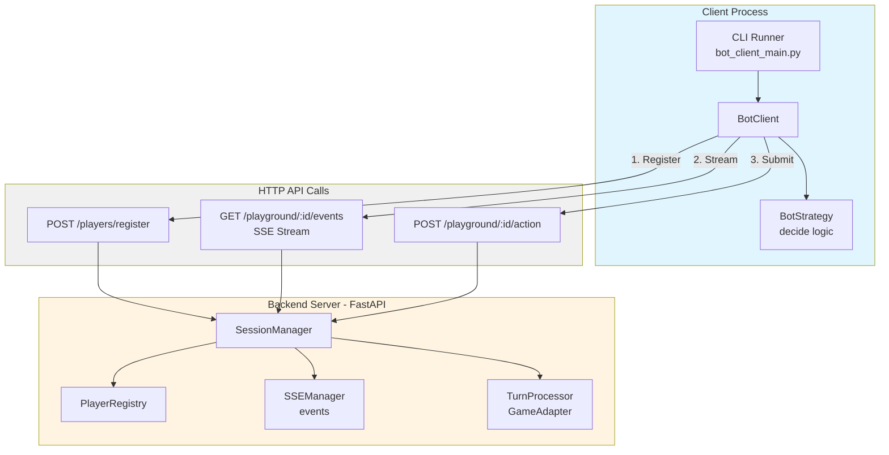
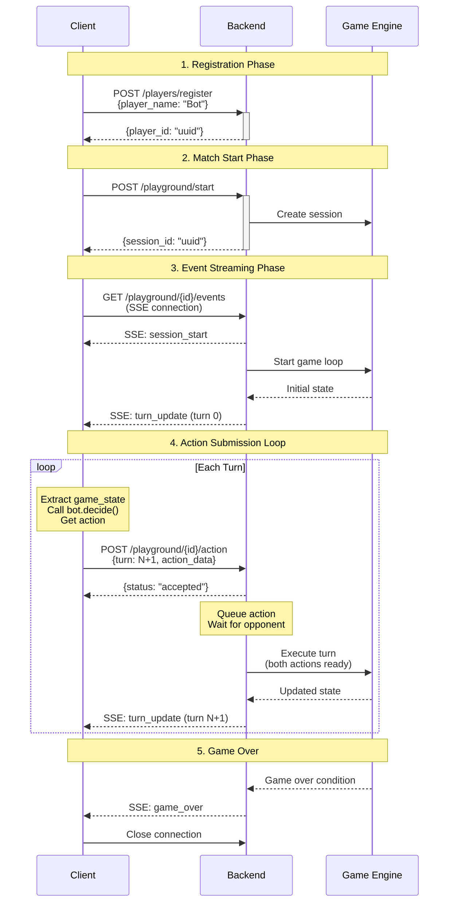

# Client Bot Integration Design Document

## 1. Overview

### 1.1 Purpose

This document details the technical design for enabling remote bot clients to play Spellcasters matches against the backend server via HTTP/SSE communication. The feature provides a client library and CLI tool that allows bot developers to:
- Register players remotely
- Connect to match sessions
- Receive real-time game events via Server-Sent Events (SSE)
- Submit bot actions automatically during gameplay
- Integrate existing `BotInterface` implementations without modification

### 1.2 Design Goals

1. **Ease of Use**: Simple CLI tool for running bots against the backend
2. **Bot Compatibility**: Support both built-in strategies and existing `BotInterface` bots
3. **Resilient Communication**: Automatic SSE reconnection and error handling
4. **Event-Driven**: React to game events and submit actions in real-time
5. **Modern Python**: Async/await throughout, type hints, clean separation of concerns

### 1.3 Related Documents

- Backend Specification: `docs/specs/spellcasters-backend/spellcasters-backend-spec_final.md`
- Bot Interface: `bots/bot_interface.py`
- Game Engine: `game/engine.py`

---

## 2. Architecture

### 2.1 High-Level Architecture



### 2.2 Component Interaction Flow

**Match Flow Sequence**:



---

## 3. Components and Interfaces

### 3.1 BotClient (`client/bot_client.py`)

The main client library for interacting with the Spellcasters backend.

**Key Methods**:
```python
class BotClient:
    async def register_player(req: PlayerRegistrationRequest) -> PlayerInfo
    async def start_match_vs_builtin(player_id: str, builtin_bot_id: str, max_events: int) -> str
    async def stream_session_events(session_id: str, max_events: Optional[int]) -> AsyncIterator[Dict]
    async def submit_action(session_id: str, player_id: str, turn: int, action: Dict) -> None
    async def play_match(session_id: str, player_id: str, max_events: Optional[int]) -> AsyncIterator[Dict]
```

**Responsibilities**:
- Player registration with backend
- Match creation against built-in bots
- SSE event streaming via `SSEClient`
- Action submission to backend
- Automated gameplay combining streaming + action submission

### 3.2 Bot Strategy Interface

Uses strategy pattern to support different bot implementations.

**Abstract Base**:
```python
class BotStrategy:
    async def decide(self, state: Dict[str, Any]) -> Dict[str, Any]:
        """Process game state and return action decision.

        Returns:
            Action dict with format: {"move": [dx, dy], "spell": {...} or None}
        """
```

**Built-in Strategies**:
- `RandomWalkStrategy`: Simple toggle-based movement for testing
- `BotInterfaceAdapter`: Wraps existing `BotInterface` implementations

### 3.3 BotInterfaceAdapter

Bridges async client interface with sync `BotInterface`.

```python
class BotInterfaceAdapter(BotStrategy):
    def __init__(self, bot_instance: Any) -> None:
        self._bot = bot_instance

    async def decide(self, state: Dict[str, Any]) -> Dict[str, Any]:
        return self._bot.decide(state)  # Call sync method
```

**Design Rationale**: Allows existing bots to work without modification, adapts sync to async seamlessly.

### 3.4 SSEClient (`client/sse_client.py`)

Low-level SSE client with automatic reconnection.

**Features**:
- Connection management with exponential backoff
- SSE protocol parsing (event/data fields)
- Event type decoding with Pydantic model validation
- Configurable timeouts and retry limits

**Configuration**:
```python
@dataclass
class SSEClientConfig:
    connect_timeout_seconds: float = 5.0
    read_timeout_seconds: float = 30.0
    reconnect_initial_backoff: float = 0.5
    reconnect_max_backoff: float = 8.0
    max_retries: int = 5
```

### 3.5 CLI Runner (`client/bot_client_main.py`)

Command-line interface for running bot matches.

**Features**:
- Dynamic bot loading from module paths
- Support for built-in and custom bot strategies
- Fully automated match gameplay
- Configurable logging and event limits

**CLI Arguments**:
- `--base-url`: Backend server URL (default: http://localhost:8000)
- `--player-name`: Player name for registration
- `--builtin-bot-id`: Opponent bot ID (default: sample_bot_1)
- `--max-events`: Maximum events to process (default: 100)
- `--log-level`: DEBUG, INFO, WARNING, ERROR (default: INFO)
- `--bot-type`: `random` or `custom` (default: random)
- `--bot-path`: Module path for custom bots (e.g., `bots.sample_bot1.sample_bot_1.SampleBot1`)

---

## 4. Data Models and Protocols

### 4.1 Action Submission Format

```python
{
  "player_id": "uuid-string",
  "turn": 1,
  "action_data": {
    "move": [dx, dy],  # Movement delta, e.g., [1, 0] for right
    "spell": {         # Optional spell action
      "name": "fireball",
      "target": [x, y]  # Optional target position
    }
  }
}
```

### 4.2 Game State Format (from turn_update events)

```python
{
  "event": "turn_update",
  "turn": 1,
  "game_state": {
    "turn": 1,
    "board_size": 15,
    "self": {
      "name": "Player 1",
      "position": [0, 0],
      "hp": 100,
      "mana": 100,
      "cooldowns": {...}
    },
    "opponent": {...},
    "artifacts": [...],
    "minions": [...]
  },
  "actions": [...],
  "events": [...],
  "timestamp": "..."
}
```

### 4.3 SSE Event Types

1. **session_start**: Match initialization with player info and initial state
2. **turn_update**: Turn results with updated game state, actions, and events
3. **game_over**: Match conclusion with winner, final state, and game result
4. **heartbeat**: Keepalive event (every 5 seconds)
5. **error**: Error notification with type and message

---

## 5. Event Processing Lifecycle

### 5.1 Backend Turn Processing


### 5.2 Client Turn Processing


### 5.3 Timing and Synchronization

**Action Collection Window**:
- Backend broadcasts `turn_update` for turn N
- Opens collection window for turn N+1
- Waits up to `TURN_TIMEOUT_SECONDS` (default 5s) for both actions
- If timeout: uses default actions
- Executes turn N+1 and repeats

**Client Timing**:
- Receives `turn_update` for turn N
- Must submit action for turn N+1 within timeout window
- Recommended: submit immediately after bot decides
- If too slow: backend uses default action

**SSE Heartbeat**:
- Backend sends heartbeat every 5 seconds
- Client maintains connection
- `SSEClient` auto-reconnects if connection lost

---

## 6. Design Decisions

### 6.1 Strategy Pattern for Bot Abstraction

**Decision**: Use strategy pattern with `BotStrategy` base class and `BotInterfaceAdapter`.

**Rationale**:
- Separation of client logic from bot decision logic
- Easy to add new strategies without modifying client
- Backward compatible with existing `BotInterface` bots
- Improved testability with mock strategies

**Alternatives Considered**:
- Direct `BotInterface` usage: Couples client to sync interface
- Callback-based: More complex, harder to debug
- Inheritance-based: Less flexible composition

**Trade-offs**:
- ✅ Clean separation, easy to extend
- ❌ Extra abstraction layer (minimal overhead)
- ❌ Async wrapper around sync `bot.decide()` (acceptable for scope)

### 6.2 Async-First Client Design

**Decision**: Implement client using `asyncio` and async/await patterns.

**Rationale**:
- Backend uses FastAPI (async framework)
- Efficient I/O for SSE streaming and HTTP requests
- Single client can handle concurrent streaming + action submission
- Modern Python standard for network programming

**Trade-offs**:
- ✅ Better performance, cleaner code
- ❌ Requires async/await understanding (acceptable for target audience)

### 6.3 Combined Event Stream + Action Submission

**Decision**: Provide both separate methods and combined `play_match()` method.

**Rationale**:
- Flexibility for advanced users with separate methods
- Convenience for common use case with `play_match()`
- Progressive disclosure (beginners use simple method, advanced use separate)

**Trade-offs**:
- ✅ Best of both worlds
- ❌ Slightly larger API surface (acceptable)

### 6.4 Action Submission on Every turn_update

**Decision**: Submit action for every `turn_update` event received.

**Rationale**:
- Game uses simultaneous turns (not alternating)
- Simplicity: no need to track turn ownership
- Backend handles validation and queuing

**Trade-offs**:
- ✅ Simple, aligns with game mechanics
- ✅ Backend validates appropriately
- ❌ May submit actions that get rejected (backend handles gracefully)

### 6.5 Dynamic Bot Loading

**Decision**: Load bots via `importlib` using module path strings.

**Rationale**:
- Maximum flexibility without code changes
- CLI-friendly (specify bot via argument)
- Standard Python mechanism
- Easy to extend with new bots

**Alternatives**:
- Hardcoded registry: Must update for each bot
- Config file: Extra file to maintain
- Directory scanning: Implicit, security concerns

**Trade-offs**:
- ✅ Maximum flexibility
- ✅ Standard library approach
- ❌ Runtime errors if path wrong (clear error messages)
- ❌ No compile-time checking (acceptable)

### 6.6 SSE Reconnection Strategy

**Decision**: Exponential backoff (0.5s to 8s, max 5 retries).

**Rationale**:
- Resilience to network issues
- Good network citizen (prevents server overload)
- Standard practice
- Configurable via `SSEClientConfig`

**Trade-offs**:
- ✅ Balance resilience and network citizenship
- ✅ Configurable for different environments
- ❌ Adds complexity (well-tested pattern)

### 6.7 Error Handling Philosophy

**Decision**:
- Client: Log errors, continue processing events
- Backend: HTTP errors for validation, default actions for timeouts

**Rationale**:
- Resilience: single error doesn't terminate match
- Debugging: errors are logged
- User experience: match continues despite mistakes
- Graceful degradation: default action better than crash

**Trade-offs**:
- ✅ Best balance of resilience and debuggability
- ✅ Matches complete even with errors
- ❌ May hide issues (mitigated by logging)

### 6.8 Turn Number Synchronization

**Decision**: Client extracts current turn from event, submits for turn + 1.

**Rationale**:
- Clear semantics: action is for *next* turn
- Server is authority on turn numbers
- Avoids race conditions and desync
- Backend validates turn number

**Trade-offs**:
- ✅ Server is source of truth
- ✅ Validation prevents desync
- ❌ Must extract turn from each event (minimal overhead)

### 6.9 No Authentication (Hackathon Version)

**Decision**: No authentication or authorization.

**Rationale**:
- Hackathon scope: focus on functionality
- Simplicity for development and testing
- Can add later without breaking core design
- Clearly documented as future work

**Trade-offs**:
- ✅ Faster development, simpler testing
- ❌ Not production-ready (acceptable for hackathon)

### 6.10 Automatic Match Playing (No Flag Required)

**Decision**: Client always plays match automatically (no `--auto-play` flag).

**Rationale**:
- Primary use case is automated play
- Simplifies CLI (fewer confusing options)
- Clearer intent: tool is for playing matches
- Reduces user friction

**Trade-offs**:
- ✅ Simpler, more focused tool
- ❌ Cannot observe without participating (acceptable - use SSE client for observation)

---

## 7. Error Scenarios and Handling

### 7.1 Client Submits Wrong Turn Number

```
Client → POST action {turn: 5}
Backend: Current turn is 3, expecting 4
Backend → HTTP 400: Invalid turn
Client: Logs error, continues listening
```

**Handling**: Client logs error, continues streaming. Backend rejects with clear error message.

### 7.2 Action Submission Timeout

```
Backend: Waiting for turn 4 actions (5s timeout)
Client 1: Submits action ✓
Client 2: No submission (timeout)
Backend: Uses default action for Client 2
Backend: Executes turn 4
Backend → SSE: turn_update (turn 4)
```

**Handling**: Backend uses default action, match continues.

### 7.3 Bot Decision Error

```
Client: Receives turn_update (turn 3)
Client: Calls bot.decide(state)
Bot: Raises exception
Client: Catches exception, logs error
Client: Continues listening (no submission)
Backend: Times out, uses default action
```

**Handling**: Client catches exception, logs, continues. Backend uses default action.

### 7.4 SSE Connection Lost

```
Client: SSE connection dropped
SSEClient: Detects disconnect
SSEClient: Exponential backoff (0.5s, 1s, 2s, ...)
SSEClient: Reconnects to /playground/:id/events
SSEClient: Resumes event stream
Client: May have missed events (uses latest state)
```

**Handling**: Automatic reconnection with exponential backoff. Client uses latest state on reconnect.

---

## 8. Concurrency Model

### 8.1 Client Side

- Single-threaded async event loop (`asyncio`)
- SSE connection runs continuously, yielding events
- Action submission happens inline when `turn_update` received
- No separate threads or processes

### 8.2 Backend Side

- Each match session runs in its own `asyncio.Task`
- Turn processing is sequential within a session
- Action collection has timeout (default 5 seconds)
- SSE broadcasting uses async queues

---

## 9. Performance Characteristics

- **Bot Decision Timeout**: 100ms soft budget per bot
- **Turn Timeout**: 5 seconds hard timeout (configurable)
- **SSE Heartbeat**: Every 5 seconds
- **Connection Retry**: Max 5 retries with exponential backoff (0.5s to 8s)

---

## 10. Security Considerations

- No authentication in hackathon version (planned for future)
- No rate limiting (planned for future)
- Input validation on all API endpoints
- Security-aware error logging (no sensitive data in logs)

---

## 11. Testing Strategy

### 11.1 Unit Tests

- `BotClient` methods (registration, match start, action submission)
- `BotInterfaceAdapter` wrapping sync bots
- `SSEClient` event parsing and reconnection logic
- Dynamic bot loading from module paths

### 11.2 Integration Tests

- End-to-end match with `RandomWalkStrategy`
- End-to-end match with custom `BotInterface` bot
- SSE connection handling and reconnection
- Error scenarios (wrong turn, timeout, bot error)

### 11.3 Manual Testing

```bash
# Test with RandomWalkStrategy
uv run python -m client.bot_client_main \
  --base-url http://localhost:8000 \
  --player-name "Random Bot" \
  --builtin-bot-id sample_bot_1 \
  --bot-type random

# Test with custom bot
uv run python -m client.bot_client_main \
  --base-url http://localhost:8000 \
  --player-name "Sample Bot 1 Remote" \
  --builtin-bot-id sample_bot_2 \
  --bot-type custom \
  --bot-path bots.sample_bot1.sample_bot_1.SampleBot1
```

---

## 12. Future Enhancements

### 12.1 Authentication

- JWT tokens for API access
- Player identity verification
- Session ownership validation
- Secure credential storage

### 12.2 Rate Limiting

- Per-player rate limits
- Per-IP rate limits
- Burst allowances
- Graceful degradation

### 12.3 Advanced Bot Strategies

- Stateful bots (learning across matches)
- Multi-bot coordination
- Bot versioning and upgrades
- Resource limits (CPU, memory)

### 12.4 Metrics and Monitoring

- Client-side metrics (latency, errors)
- Server-side metrics (active connections, turn times)
- Distributed tracing
- Performance profiling

### 12.5 Protocol Versioning

- Semantic versioning
- Backward compatibility
- Deprecation strategy
- Version negotiation

---

## 13. Deployment Considerations

- Client runs on any machine with Python 3.10+
- Requires network access to backend server (HTTP/HTTPS)
- SSE connections are long-lived (keep-alive recommended)
- Backend must be running before client connects

---

## 14. Best Practices

### 14.1 For Client Developers

1. **Validate game state** before calling `bot.decide()`
2. **Submit actions quickly** - bot decision time counts toward timeout
3. **Handle SSE errors gracefully** - let SSEClient handle reconnection
4. **Log all errors** but don't crash
5. **Respect event ordering** - process in order received

### 14.2 For Backend Developers

1. **Always validate** action submissions
2. **Use appropriate timeouts** - allow time for bot decisions
3. **Send heartbeats regularly** - prevent connection timeouts
4. **Broadcast events atomically** - ensure all SSE connections receive in order

---

## 15. Summary

The client bot integration provides a robust, flexible system for remote bot gameplay:

1. **Simple to Use**: CLI tool with minimal required arguments
2. **Backward Compatible**: Existing `BotInterface` bots work without modification
3. **Resilient**: Automatic reconnection and comprehensive error handling
4. **Modern**: Async/await, type hints, clean architecture
5. **Extensible**: Easy to add new bot strategies and features

The design balances simplicity for hackathon participants with robustness for reliable automated gameplay, while maintaining clear paths for future production-readiness enhancements.
