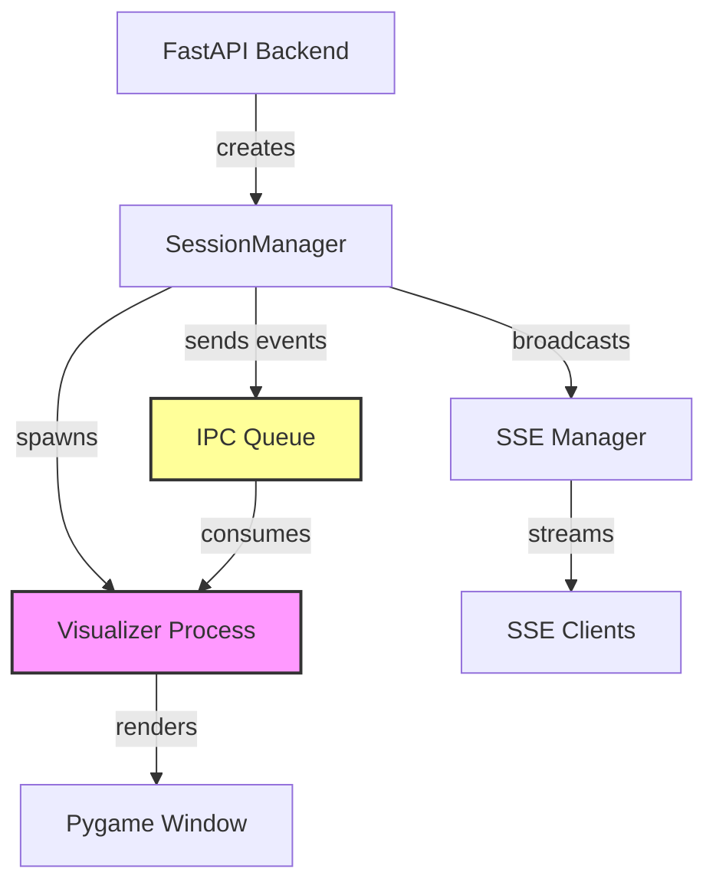

# Match Visualization Design Document

## 1. Overview

### 1.1 Purpose

This document details the technical design for integrating real-time pygame-based match visualization with the FastAPI backend server. The feature enables opt-in live visualization of matches during demos and presentations by spawning separate visualizer processes that consume game events via IPC (Inter-Process Communication).

### 1.2 Design Goals

1. **Minimal Backend Impact**: Visualization should not affect match execution or API performance
2. **Process Isolation**: Each visualized session runs in an independent process to prevent interference
3. **Resilient Error Handling**: Visualization failures must not crash the backend or affect API consumers
4. **Backward Compatibility**: Existing API contracts and SSE infrastructure remain unchanged
5. **Local Development Focus**: Designed for display-capable environments, not production deployment

### 1.3 Related Documents

- Requirements: `docs/specs/match-visualization/requirements.md`
- Backend Specification: `docs/specs/spellcasters-backend/spellcasters-backend-spec_final.md`
- Existing Visualizer: `simulator/visualizer.py`

---

## 2. Architecture

### 2.1 High-Level Architecture



### 2.2 Component Interaction Flow

**Session Creation with Visualization**:

1. Client sends `POST /playground/start` with `visualize=true`
2. `SessionManager.create_session()` creates `SessionContext` with visualizer process
3. Visualizer process spawns and initializes pygame window
4. IPC queue is established for event communication
5. Match loop begins, broadcasting to both SSE clients and visualizer

**Turn Execution with Visualization**:

1. `SessionManager._run_match_loop()` executes turn via `GameEngineAdapter`
2. `TurnEvent` is created with game state, actions, and log line
3. Event is broadcast to SSE clients via `SSEManager.broadcast()`
4. Event is sent to visualizer via IPC queue (non-blocking)
5. Visualizer consumes event and renders animation
6. **Match loop waits for animation to complete** (configurable delay, default 0.6s when visualizer enabled)

**Game Over with Visualization**:

1. `GameEngineAdapter.check_game_over()` detects game end
2. `GameEngineAdapter.create_game_over_event()` creates event with `winner_name` mapped from player_id to bot name
3. `GameOverEvent` is broadcast to SSE clients with correct winner name
4. `GameOverEvent` is sent to visualizer via IPC with winner name
5. SSE clients disconnect, but **session remains alive if visualizer is enabled** (no automatic cleanup)
6. Visualizer displays winner overlay ("THE WINNER IS [NAME]!" or "DRAW!") with "EXIT" button
7. **User clicks EXIT button** → `display_end_game_message()` returns → visualizer sets `_running = False` → event loop exits → process terminates cleanly
8. Alternatively, user can close window (pygame QUIT event) or admin can terminate via `DELETE /playground/{session_id}` API

### 2.3 Process Model

**Parent Process (FastAPI Backend)**:
- Manages session lifecycle
- Executes game engine turns
- Broadcasts SSE events
- Sends events to visualizer via IPC
- Monitors visualizer process health

**Child Process (Visualizer)**:
- Initializes pygame window
- Consumes events from IPC queue
- Renders game state and animations
- Handles user input (window close, button clicks)
- **Shows final game state and winner** after game ends
- **Waits for user to click EXIT button** via `display_end_game_message()` blocking call
- Exits when user clicks EXIT, closes window, or receives admin shutdown signal

---

## 3. Components and Interfaces

### 3.1 SessionCreationRequest Extension

**File**: `backend/app/models/sessions.py`

**Changes**:
```python
class SessionCreationRequest(BaseModel):
    """Request model for creating a new game session."""
    
    player_1_config: Dict[str, Any] = Field(..., description="Player 1 configuration")
    player_2_config: Dict[str, Any] = Field(..., description="Player 2 configuration")
    settings: Optional[Dict[str, Any]] = Field(default=None, description="Optional game settings override")
    visualize: bool = Field(default=False, description="Enable pygame visualization for this session")
```

**Rationale**: Adding `visualize` field to existing request model maintains backward compatibility (defaults to `False`) while enabling opt-in visualization.

---

### 3.2 SessionContext Extension

**File**: `backend/app/services/session_manager.py`

**Changes**:
```python
@dataclass
class SessionContext:
    session_id: str
    game_state: GameState
    adapter: GameEngineAdapter
    task: Optional[asyncio.Task]
    created_at: datetime
    
    # NEW: Visualization support
    visualizer_process: Optional[multiprocessing.Process] = None
    visualizer_queue: Optional[multiprocessing.Queue] = None
    visualizer_enabled: bool = False
```

**Rationale**: Extends existing `SessionContext` to track visualizer process and IPC channel without breaking existing code.

---

### 3.3 VisualizerService

**New File**: `backend/app/services/visualizer_service.py`

**Purpose**: Encapsulates all visualizer process management logic, keeping `SessionManager` focused on game orchestration.

**Class Structure**:
```python
class VisualizerService:
    """Manages visualizer process lifecycle and event communication."""
    
    def __init__(self):
        """Initialize the visualizer service."""
        self._logger = logging.getLogger(__name__)
    
    def spawn_visualizer(
        self, 
        session_id: str,
        player1_name: str,
        player2_name: str,
        player1_sprite: Optional[str] = None,
        player2_sprite: Optional[str] = None
    ) -> Tuple[Optional[multiprocessing.Process], Optional[multiprocessing.Queue]]:
        """Spawn a visualizer process for a session.
        
        Returns:
            Tuple of (process, queue) or (None, None) on failure
        """
    
    def send_event(
        self,
        queue: multiprocessing.Queue,
        event: Union[TurnEvent, GameOverEvent],
        timeout: float = 0.1
    ) -> bool:
        """Send an event to the visualizer process.
        
        Returns:
            True if sent successfully, False otherwise
        """
    
    def terminate_visualizer(
        self,
        process: multiprocessing.Process,
        queue: multiprocessing.Queue,
        timeout: float = 5.0
    ) -> None:
        """Gracefully terminate a visualizer process."""
    
    @staticmethod
    def _visualizer_process_main(
        session_id: str,
        event_queue: multiprocessing.Queue,
        player1_name: str,
        player2_name: str,
        player1_sprite: Optional[str],
        player2_sprite: Optional[str]
    ) -> None:
        """Entry point for visualizer child process."""
```

**Key Design Decisions**:

1. **Static Process Entry Point**: `_visualizer_process_main()` is a static method to ensure it's picklable for multiprocessing
2. **Non-Blocking Sends**: `send_event()` uses `queue.put_nowait()` with try-except to prevent blocking the match loop
3. **Graceful Termination**: `terminate_visualizer()` attempts clean shutdown before force-killing
4. **Error Isolation**: All exceptions are caught and logged, never propagated to caller

---

### 3.4 VisualizerAdapter

**New File**: `backend/app/services/visualizer_adapter.py`

**Purpose**: Adapts backend event models to the format expected by the existing `simulator/visualizer.py`.

**Class Structure**:
```python
class VisualizerAdapter:
    """Adapts backend events to visualizer-compatible format."""
    
    def __init__(
        self,
        session_id: str,
        event_queue: multiprocessing.Queue,
        player1_name: str,
        player2_name: str,
        player1_sprite: Optional[str],
        player2_sprite: Optional[str]
    ):
        """Initialize the visualizer adapter."""
        self._session_id = session_id
        self._queue = event_queue
        self._player1_name = player1_name
        self._player2_name = player2_name
        self._player1_sprite = player1_sprite
        self._player2_sprite = player2_sprite
        self._visualizer: Optional[Visualizer] = None
        self._states: List[Dict[str, Any]] = []
    
    def initialize_visualizer(self) -> None:
        """Initialize pygame and create Visualizer instance immediately, opening the window."""
    
    def process_events(self) -> None:
        """Main event loop: consume events from queue and render in real-time.

        Window remains open after game completion until manually closed."""
    
    def handle_turn_event(self, event: Dict[str, Any]) -> None:
        """Process a turn_update event and render it immediately with animation."""
    
    def handle_game_over_event(self, event: Dict[str, Any]) -> None:
        """Process a game_over event and display end game message."""
    
    def _handle_pygame_events(self) -> None:
        """Handle pygame events (window close, QUIT) with display initialization guard."""
    
    def shutdown(self) -> None:
        """Clean shutdown of pygame."""
```

**Key Design Decisions**:

1. **Immediate Window Creation**: Pygame window is created immediately in `initialize_visualizer()` when the session starts
2. **Real-Time Rendering**: Each turn is rendered immediately as events arrive, with smooth animations between states
3. **State Accumulation**: Collects game states in `_states` list for reference and animation transitions
4. **Event Queue Polling**: Uses `queue.get(timeout=0.1)` to allow periodic pygame event handling
5. **Pygame Isolation**: All pygame imports and calls are contained in this module
6. **Graceful Degradation**: If pygame is unavailable, adapter logs error and exits cleanly
7. **Pygame Event Guard**: Only handles pygame events if `pygame.display.get_init()` returns True to prevent "video system not initialized" errors
8. **Animation Flow**: Uses `Visualizer.animate_transition()` for smooth transitions between turns and `Visualizer.display_end_game_message()` for game completion
9. **Persistent Window with EXIT Button**: After game over, `display_end_game_message()` blocks waiting for user to click EXIT button. When clicked, method returns and visualizer sets `_running = False` to exit. Window can also be closed via pygame QUIT event or admin shutdown signal.

---

### 3.5 SessionManager Integration

**File**: `backend/app/services/session_manager.py`

**Modified Methods**:

```python
class SessionManager:
    def __init__(
        self,
        db_service: Optional[DatabaseService] = None,
        sse_manager: Optional[SSEManager] = None,
        match_logger: Optional[MatchLogger] = None,
        visualizer_service: Optional[VisualizerService] = None,  # NEW
    ):
        # ... existing initialization ...
        self._visualizer_service = visualizer_service  # Note: Not defaulting to new instance
    
    async def create_session(
        self, 
        player_1: PlayerConfig, 
        player_2: PlayerConfig,
        visualize: bool = False  # NEW parameter
    ) -> str:
        """Create a new session and start the match loop."""
        # ... existing session creation logic ...
        
        # NEW: Spawn visualizer if requested
        if visualize:
            try:
                process, queue = self._visualizer_service.spawn_visualizer(
                    session_id=session_id,
                    player1_name=bot1.name,
                    player2_name=bot2.name,
                    player1_sprite=getattr(bot1, 'wizard_sprite_path', None),
                    player2_sprite=getattr(bot2, 'wizard_sprite_path', None)
                )
                if process and queue:
                    context.visualizer_process = process
                    context.visualizer_queue = queue
                    context.visualizer_enabled = True
                    logger.info(f"Visualizer spawned for session {session_id} (PID: {process.pid})")
                else:
                    logger.warning(f"Failed to spawn visualizer for session {session_id}, continuing headless")
            except Exception as exc:
                logger.error(f"Error spawning visualizer for session {session_id}: {exc}", exc_info=True)
        
        # ... rest of method ...
    
    async def _run_match_loop(self, ctx: SessionContext) -> None:
        """Run the automated match loop until completion."""
        try:
            # ... existing turn execution logic ...
            
            # Broadcast turn update over SSE if configured
            if self._sse:
                await self._sse.broadcast(ctx.session_id, turn_event)
            
            # NEW: Send to visualizer if enabled
            if ctx.visualizer_enabled and ctx.visualizer_queue:
                try:
                    self._visualizer_service.send_event(ctx.visualizer_queue, turn_event)
                except Exception as exc:
                    logger.warning(f"Failed to send turn event to visualizer for {ctx.session_id}: {exc}")
            
            # ... game over detection ...
            
            if result is not None:
                # ... existing game over logic ...
                
                # Broadcast game over event
                if self._sse:
                    await self._sse.broadcast(ctx.session_id, game_over_event)
                
                # NEW: Send to visualizer if enabled
                if ctx.visualizer_enabled and ctx.visualizer_queue:
                    try:
                        self._visualizer_service.send_event(ctx.visualizer_queue, game_over_event)
                    except Exception as exc:
                        logger.warning(f"Failed to send game over event to visualizer for {ctx.session_id}: {exc}")
                
                # ... rest of method ...
            
            # Delay between turns to allow SSE event delivery and animation completion
            # When visualizer is enabled, wait for animation duration to complete
            # Otherwise, use minimal delay
            if ctx.visualizer_enabled:
                from ..core.config import settings
                # Wait for animation to complete plus a small buffer for rendering
                await asyncio.sleep(settings.visualizer_animation_duration + 0.1)
            else:
                await asyncio.sleep(0.01)

        finally:
            # NOTE: Visualizer is NOT terminated automatically when session ends.
            # It remains open to show the final game state.
            # Admin can manually terminate via cleanup_session() API or user can close the window.
            pass
```

**Additional SessionManager Methods**:

```python
    async def cleanup_session(self, session_id: str) -> bool:
        """Clean up a session, including visualizer termination."""
        # ... get context ...
        
        # NEW: Terminate visualizer before cancelling task
        if ctx.visualizer_enabled and ctx.visualizer_process:
            try:
                logger.info(f"Terminating visualizer for session {session_id} during cleanup")
                self._visualizer_service.terminate_visualizer(
                    ctx.visualizer_process,
                    ctx.visualizer_queue
                )
            except Exception as exc:
                logger.error(f"Error terminating visualizer during cleanup for {session_id}: {exc}", exc_info=True)
        
        # ... cancel task and remove from sessions dict ...
```

**Rationale**: Minimal changes to `SessionManager`, delegating all visualizer logic to `VisualizerService`. All visualizer operations are wrapped in try-except blocks to ensure they never crash the session management.

---

### 3.6 API Endpoint Update

**File**: `backend/app/api/sessions.py`

**Modified Endpoint**:
```python
@router.post("/playground/start")
async def start_playground_match(payload: SessionCreationRequest) -> Dict[str, str]:
    """Start a new playground session and return its session_id."""
    try:
        # ... existing validation ...
        
        session_id = await runtime.session_manager.create_session(
            p1_cfg, 
            p2_cfg,
            visualize=payload.visualize  # NEW: Pass visualize flag
        )
        return {"session_id": session_id}
    
    except HTTPException:
        raise
    except Exception as exc:
        logger.error(f"Failed to start session: {exc}", exc_info=True)
        raise HTTPException(status_code=500, detail="Failed to start session")
```

**Rationale**: Single-line change to pass through the `visualize` parameter.

---

### 3.7 SSE Streaming Endpoint Update

**File**: `backend/app/api/streaming.py`

**Modified Cleanup Logic**:
```python
@router.get("/playground/{session_id}/events")
async def stream_session_events(session_id: str, request: Request) -> StreamingResponse:
    """Stream real-time session events over Server-Sent Events (SSE)."""
    # ... existing SSE streaming logic ...
    
    async def event_generator() -> AsyncGenerator[str, None]:
        try:
            # ... event streaming ...
        finally:
            await runtime.sse_manager.remove_connection(session_id, stream)
            await stream.close()

            # Check if this was the last connection for a completed session
            # If so, clean up the session resources, but ONLY if no visualizer is active
            try:
                ctx = await runtime.session_manager.get_session(session_id)
                # Only cleanup if game is over, no more SSE connections, AND no active visualizer
                if ctx.game_state.status != "active":
                    connection_count = len(runtime.sse_manager._streams_by_session.get(session_id, []))
                    if connection_count == 0:
                        # Do NOT cleanup if visualizer is enabled - let it stay open
                        if ctx.visualizer_enabled:
                            logger.info(
                                f"Last client disconnected from completed session {session_id}, "
                                f"but visualizer is active - keeping session alive"
                            )
                        else:
                            logger.info(f"Last client disconnected from completed session {session_id}, triggering cleanup")
                            await runtime.session_manager.cleanup_session(session_id)
            except Exception as exc:
                logger.debug(f"Session {session_id} already cleaned up or not found: {exc}")
```

**Rationale**: Prevents automatic session cleanup when visualizer is enabled, allowing the window to remain open indefinitely after the game ends. This ensures users can review the final game state before manually closing the visualizer.

---

## 4. Data Models

### 4.1 IPC Event Format

Events sent via multiprocessing queue are serialized as dictionaries matching the Pydantic model structure:

**TurnEvent IPC Format**:
```python
{
    "event": "turn_update",
    "turn": 5,
    "game_state": {
        "self": {"name": "bot1", "hp": 80, "mana": 50, "position": [3, 4], ...},
        "opponent": {"name": "bot2", "hp": 70, "mana": 60, "position": [6, 5], ...},
        "artifacts": [...],
        "minions": [...],
        "board_size": 10
    },
    "actions": [
        {"player_id": "uuid1", "turn": 5, "move": [3, 4], "spell": {...}},
        {"player_id": "uuid2", "turn": 5, "move": [6, 5], "spell": null}
    ],
    "events": ["Bot1 moved to [3, 4]", "Bot2 cast fireball"],
    "log_line": "Turn 5: Bot1 moved, Bot2 attacked",
    "timestamp": "2025-10-18T10:30:45.123456"
}
```

**GameOverEvent IPC Format**:
```python
{
    "event": "game_over",
    "winner": "uuid1",
    "winner_name": "bot1",
    "final_state": {...},  # Same structure as game_state above
    "game_result": {
        "session_id": "session-uuid",
        "winner": "uuid1",
        "result_type": "victory",
        "total_rounds": 25,
        "game_duration": 12.5,
        ...
    },
    "timestamp": "2025-10-18T10:31:00.000000"
}
```

**Control Message Format**:
```python
{
    "event": "shutdown",
    "reason": "session_deleted"
}
```

### 4.2 Visualizer State Mapping

The existing `Visualizer` class expects a list of game states in a specific format. The `VisualizerAdapter` transforms backend events:

**Backend Game State** → **Visualizer State**:
- `game_state["self"]` → Mapped to player 1 or 2 based on name
- `game_state["opponent"]` → Mapped to other player
- `game_state["artifacts"]` → Passed through
- `game_state["minions"]` → Passed through
- `game_state["board_size"]` → Passed through

---

## 5. Error Handling

### 5.1 Error Scenarios and Responses

| Scenario | Detection | Response | User Impact |
|----------|-----------|----------|-------------|
| Pygame not installed | Import error in visualizer process | Log warning, process exits immediately | API returns 200 OK, match runs headless |
| No display available | pygame.display.set_mode() fails | Log error, process exits | API returns 200 OK, match runs headless |
| Visualizer crash mid-match | Process exit detected by parent | Log error, continue match | SSE clients unaffected, match completes |
| IPC queue full | queue.put_nowait() raises Full | Log warning, skip event | Visualizer may miss frames but continues |
| User closes window early | pygame.QUIT event | Visualizer exits cleanly | Match continues, SSE clients unaffected |
| Backend shutdown | Lifespan shutdown handler | Terminate all visualizer processes | Graceful cleanup |

### 5.2 Error Handling Strategy

**Principle**: **Fail Silently, Log Verbosely**

All visualization errors are:
1. Caught at the earliest possible point
2. Logged with full context (session_id, error details)
3. Never propagated to API layer or SSE clients
4. Handled by continuing in headless mode

**Implementation Pattern**:
```python
try:
    # Visualization operation
    self._visualizer_service.send_event(queue, event)
except Exception as exc:
    logger.error(f"Visualization error for session {session_id}: {exc}", exc_info=True)
    # Continue without raising
```

### 5.3 Process Health Monitoring

**Passive Monitoring**:
- Check `process.is_alive()` before sending events
- If process is dead, log it and disable visualizer for that session
- No active health checks (avoids overhead)

**Cleanup Triggers**:
1. **User clicks EXIT button**: After game over, `display_end_game_message()` blocks until user clicks EXIT. When clicked, visualizer sets `_running = False` and exits cleanly.
2. **User closes pygame window**: pygame.QUIT event triggers immediate exit
3. **Admin API termination**: `DELETE /playground/{session_id}` sends shutdown event via IPC queue
4. **Explicit shutdown event**: Sent via IPC queue (e.g., during backend shutdown via lifespan handler)
5. **SSE client disconnect**: When last SSE client disconnects from a completed session, automatic cleanup is **prevented if visualizer is enabled**. This allows the visualizer window to stay open for review.

**Winner Name Display**: `GameEngineAdapter.create_game_over_event()` maps winner player_id to bot name, ensuring visualizer displays correct winner ("THE WINNER IS [BOT NAME]!") or "DRAW!" for ties.

**Session Lifecycle with Visualization**:
- Game ends → SSE clients receive `game_over` event and disconnect
- Backend checks: if visualizer is enabled, session **stays alive** (no automatic cleanup)
- Visualizer continues to display final game state with EXIT button
- User manually closes visualizer → session can be cleaned up via admin API

---

## 6. Performance Considerations

### 6.1 Performance Targets

| Metric | Target | Rationale |
|--------|--------|-----------|
| Turn processing overhead | < 50ms | Maintain responsive match execution |
| IPC send timeout | 100ms | Prevent blocking on slow visualizer |
| Process spawn time | < 500ms | Acceptable delay for demo use case |
| Memory per visualizer | < 100MB | Support 5-10 concurrent visualized sessions |

### 6.2 Optimization Strategies

**Non-Blocking IPC**:
```python
def send_event(self, queue: multiprocessing.Queue, event: Event, timeout: float = 0.1) -> bool:
    try:
        # Use put_nowait() to avoid blocking
        queue.put_nowait(event.model_dump())
        return True
    except queue.Full:
        logger.warning(f"Visualizer queue full, dropping event")
        return False
```

**Event Serialization**:
- Use `model_dump()` instead of `model_dump_json()` to avoid JSON serialization overhead
- Multiprocessing queue handles pickling automatically

**Process Isolation**:
- Each visualizer runs in separate process with own memory space
- Pygame rendering does not impact backend event loop
- CPU-intensive animation work offloaded to child process

### 6.3 Resource Limits

**Recommended Limits** (via configuration):
```python
# backend/app/core/config.py
MAX_CONCURRENT_VISUALIZED_SESSIONS: int = 10
VISUALIZER_QUEUE_SIZE: int = 100  # Max events in queue
VISUALIZER_SHUTDOWN_TIMEOUT: float = 5.0  # Seconds to wait for clean exit
VISUALIZER_ANIMATION_DURATION: float = 0.5  # Seconds per turn animation
VISUALIZER_INITIAL_RENDER_DELAY: float = 0.3  # Initial render delay
```

**Animation Timing**:
- When visualizer is enabled, match loop waits `VISUALIZER_ANIMATION_DURATION + 0.1` seconds between turns
- This ensures animations complete before the next turn begins
- Without visualizer, minimal 0.01 second delay is used for fast execution
- Performance impact: ~0.6s per turn with visualizer vs ~0.01s without

---

## 7. Testing Strategy

### 7.1 Unit Tests

**File**: `backend/tests/test_visualizer_service.py`

**Test Cases**:
1. `test_spawn_visualizer_success()` - Mock multiprocessing, verify process creation
2. `test_spawn_visualizer_pygame_unavailable()` - Mock import error, verify graceful failure
3. `test_send_event_success()` - Verify event serialization and queue put
4. `test_send_event_queue_full()` - Verify non-blocking behavior on full queue
5. `test_terminate_visualizer_graceful()` - Verify clean shutdown
6. `test_terminate_visualizer_force()` - Verify force-kill after timeout

**Mocking Strategy**:
```python
@pytest.fixture
def mock_multiprocessing(monkeypatch):
    mock_process = MagicMock()
    mock_queue = MagicMock()
    monkeypatch.setattr('multiprocessing.Process', lambda **kwargs: mock_process)
    monkeypatch.setattr('multiprocessing.Queue', lambda: mock_queue)
    return mock_process, mock_queue
```

### 7.2 Integration Tests

**File**: `backend/tests/test_visualized_session.py`

**Test Cases**:
1. `test_create_session_with_visualize_true()` - Verify visualizer spawns
2. `test_create_session_with_visualize_false()` - Verify no visualizer spawned
3. `test_match_loop_sends_events_to_visualizer()` - Verify event flow
4. `test_visualizer_crash_does_not_affect_match()` - Kill process mid-match, verify match continues
5. `test_session_cleanup_terminates_visualizer()` - Verify cleanup on session deletion

**Integration Test Environment**:
- Use `pytest-asyncio` for async test support
- Mock pygame imports to avoid display requirement
- Use real multiprocessing (not mocked) to test IPC

### 7.3 Manual Testing Checklist

**Local Development Testing**:
- [ ] Start session with `visualize=true`, verify window opens
- [ ] Verify animations play smoothly during match
- [ ] Close window mid-match, verify match continues
- [ ] Start 3 concurrent visualized sessions, verify no interference
- [ ] Kill visualizer process manually, verify backend logs error and continues
- [ ] Delete session via API, verify visualizer closes
- [ ] Shutdown backend, verify all visualizers terminate

**Error Scenario Testing**:
- [ ] Uninstall pygame, verify graceful degradation
- [ ] Set `DISPLAY=` (no display), verify graceful degradation
- [ ] Fill visualizer queue by pausing process, verify events dropped

---

## 8. Deployment Considerations

### 8.1 Environment Requirements

**Required**:
- Python 3.10+
- pygame 2.5.0+ (optional, for visualization)
- Display server (X11, Wayland, or macOS native)

**Configuration**:
```bash
# .env
PLAYGROUND_ENABLE_VISUALIZATION=true  # Global toggle
PLAYGROUND_MAX_VISUALIZED_SESSIONS=10
```

### 8.2 Deployment Scenarios

**Local Development** (Supported):
- macOS, Linux, Windows with display
- Run backend with `uv run uvicorn backend.app.main:app --reload`
- Visualizer windows appear on local display

**Docker** (Not Supported):
- Headless containers lack display server
- Visualization requests will fail gracefully and log warnings

**Remote Server** (Not Supported):
- SSH sessions without X11 forwarding lack display
- Use headless mode or configure X11 forwarding (out of scope)

### 8.3 Monitoring and Observability

**Logging**:
```python
# Visualizer lifecycle
logger.info(f"Visualizer spawned for session {session_id} (PID: {process.pid})")
logger.info(f"Visualizer terminated for session {session_id}")
logger.warning(f"Visualizer failed to spawn for session {session_id}: {error}")

# Event communication
logger.debug(f"Sent {event.event} to visualizer for session {session_id}")
logger.warning(f"Visualizer queue full for session {session_id}, dropping event")

# Error scenarios
logger.error(f"Visualizer process crashed for session {session_id}: {error}")
```

**Metrics** (Future Enhancement):
- `visualizer_spawns_total` - Counter of visualizer process spawns
- `visualizer_failures_total` - Counter of visualizer spawn failures
- `visualizer_events_sent_total` - Counter of events sent to visualizers
- `visualizer_events_dropped_total` - Counter of dropped events (queue full)

---

## 9. Security Considerations

### 9.1 Process Isolation

**Risk**: Malicious visualizer process could access parent process memory

**Mitigation**: 
- Use `multiprocessing` (not `threading`) for true process isolation
- Child process has no access to parent memory or file descriptors
- IPC queue is the only communication channel

### 9.2 Resource Exhaustion

**Risk**: Spawning too many visualizers could exhaust system resources

**Mitigation**:
- Enforce `MAX_CONCURRENT_VISUALIZED_SESSIONS` limit
- Reuse existing session limit (`MAX_CONCURRENT_SESSIONS`)
- Visualizers are tied to sessions, which are already rate-limited

### 9.3 Display Server Access

**Risk**: Visualizer could be used to capture screenshots or keylog

**Mitigation**:
- Feature is local-only, not exposed to remote users
- Visualizer only renders game state, no user input capture
- Standard OS-level display permissions apply

---

## 10. Future Enhancements

### 10.1 Visualization Recording

**Goal**: Capture visualizer output to video file

**Approach**:
- Add `record=true` parameter to session creation
- Use `pygame.image.save()` to capture frames
- Post-process frames into video with `ffmpeg`

**Challenges**:
- Requires headless rendering (pygame dummy video driver)
- Large disk space for frame storage
- Video encoding adds CPU overhead

### 10.2 Web-Based Visualization

**Goal**: Stream visualization to browser clients

**Approach**:
- Replace pygame with HTML5 Canvas rendering
- Send game state updates via SSE to frontend
- Render animations in JavaScript

**Challenges**:
- Requires frontend development
- Different animation system than pygame
- Increased backend complexity

### 10.3 Replay Visualization

**Goal**: Visualize historical matches from logs

**Approach**:
- Read match log JSON files
- Spawn visualizer with pre-recorded events
- Play back at adjustable speed

**Challenges**:
- Requires match log format compatibility
- No real-time constraints, simpler implementation
- Could reuse existing visualizer code

---

## 11. Open Questions and Decisions

### 11.1 Resolved Decisions

| Question | Decision | Rationale |
|----------|----------|-----------|
| IPC mechanism? | `multiprocessing.Queue` | Built-in, cross-platform, simple API |
| Event format? | Pydantic model dicts | Reuse existing event models, no new serialization |
| Error handling? | Fail silently, log verbosely | Visualization is non-critical, don't break API |
| Process lifecycle? | Spawn on session create, terminate on game over | Simplest model, clear ownership |
| Visualizer adapter? | Separate module | Isolate pygame dependencies, testable |

### 11.2 Open Questions

| Question | Options | Recommendation |
|----------|---------|----------------|
| Should we support multiple viewers per session? | Yes / No | No (out of scope, adds complexity) |
| Should we add visualization quality settings? | Yes / No | No (out of scope, use defaults) |
| Should we expose visualizer PID in API? | Yes / No | No (internal implementation detail) |
| Should we add a global visualization toggle? | Yes / No | Yes (via config, useful for disabling in prod) |
