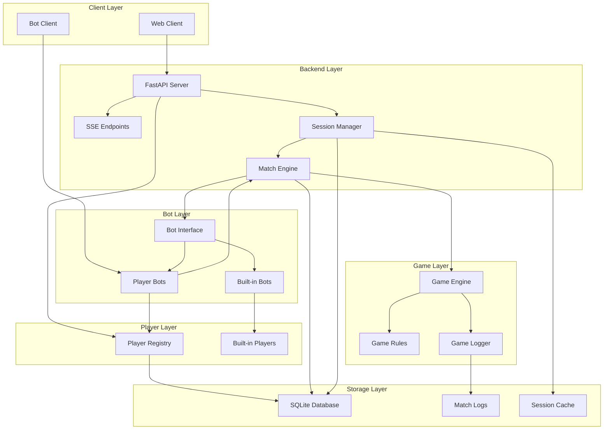

# Spellcasters Playground Backend - Technical Design

## Overview

The Spellcasters Playground Backend is a FastAPI-based real-time multiplayer bot battle system designed for hackathon environments. The system enables participants to register, submit Python bots, and engage in turn-based matches with live streaming via Server-Sent Events (SSE). The backend integrates with the existing game engine while providing comprehensive match logging, replay functionality, and secure bot code execution.

## Architecture

### High-Level Architecture



### Technology Stack

- **Framework**: FastAPI 0.104+ with async/await support
- **Real-time**: Server-Sent Events (SSE) via StreamingResponse
- **Concurrency**: asyncio for session management
- **Database**: SQLite with SQLModel for data persistence and ORM
- **Security**: Restricted execution sandbox for bot code
- **Validation**: Pydantic models for request/response validation
- **Game Engine**: Integration with existing `/game` directory components
- **Logging**: Structured logging with session context

## Data Models

### Player Models

```python
class PlayerRegistration(BaseModel):
    player_name: str = Field(..., min_length=1, max_length=50)
    submitted_from: Literal["online", "upload"] = "online"
    sprite_path: Optional[str] = None
    minion_sprite_path: Optional[str] = None

class Player(BaseModel):
    """Encapsulates visible details: ID, name, sprite, game stats"""
    player_id: str = Field(..., description="UUID string")
    player_name: str
    submitted_from: str
    sprite_path: Optional[str] = None
    minion_sprite_path: Optional[str] = None
    total_matches: int = 0
    wins: int = 0
    losses: int = 0
    draws: int = 0
    created_at: datetime
    is_builtin: bool = False  # True for built-in players
```

### Player Registry

```python
class PlayerRegistry:
    """Manages all players (both user-registered and built-in)"""
    
    def __init__(self):
        self.players: Dict[str, Player] = {}
        # Pre-register built-in players
        self._register_builtin_players()
    
    def _register_builtin_players(self) -> None:
        """Register all built-in players at startup"""
        for player in BuiltinBotRegistry.BUILTIN_PLAYERS.values():
            self.players[player.player_id] = player
    
    def register_player(self, registration: PlayerRegistration) -> Player:
        """Register a new user player"""
        player = Player(
            player_id=str(uuid4()),
            player_name=registration.player_name,
            submitted_from=registration.submitted_from,
            sprite_path=registration.sprite_path,
            minion_sprite_path=registration.minion_sprite_path,
            created_at=datetime.now()
        )
        self.players[player.player_id] = player
        return player
    
    def get_player(self, player_id: str) -> Optional[Player]:
        """Get player by ID"""
        return self.players.get(player_id)
    
    def update_player_stats(self, player_id: str, result: GameResult) -> None:
        """Update player statistics after a match"""
        player = self.players.get(player_id)
        if player:
            player.total_matches += 1
            if result.winner == player_id:
                player.wins += 1
            elif result.result_type == GameResultType.DRAW:
                player.draws += 1
            else:
                player.losses += 1
    
    def list_players(self, include_builtin: bool = True) -> List[Player]:
        """List all players"""
        if include_builtin:
            return list(self.players.values())
        return [p for p in self.players.values() if not p.is_builtin]
    
    async def delete_player(self, player_id: str) -> bool:
        """Delete a player with validation and constraint checking"""
        # Validate player exists and is not built-in
        # Check for active sessions
        # Cascade delete related game results
        # Remove player from registry
```

### Bot Models

```python
class BotInterface(ABC):
    """
    Standardized interface for all bots (built-in and player).
    Encapsulates in-game execution: game strategy, turn actions etc.
    Maintains strong one-directional reference to Player instance.
    """
    
    def __init__(self, player: Player):
        """Initialize bot with reference to Player instance"""
        self._player = player
    
    @property
    def player(self) -> Player:
        """Get the Player instance this bot represents"""
        return self._player
    
    @property
    def name(self) -> str:
        """Bot identification name (delegates to player)"""
        return self._player.player_name
    
    @property
    def player_id(self) -> str:
        """Unique player ID (delegates to player)"""
        return self._player.player_id
    
    @abstractmethod
    def decide(self, state: Dict[str, Any]) -> Dict[str, Any]:
        """Main decision method called by game engine"""
        pass
    
    @property
    def is_builtin(self) -> bool:
        """Flag indicating if this is a built-in bot"""
        return self._player.is_builtin

class BotCreationRequest(BaseModel):
    """Request to create a new player bot"""
    bot_code: str
    player_id: Optional[str] = None  # If None, must provide player_registration
    player_registration: Optional[PlayerRegistration] = None

class BotInfo(BaseModel):
    """Information about available bots"""
    bot_type: Literal["builtin", "player"]
    bot_id: str
    player_id: str
    player_name: str
    description: Optional[str] = None
    difficulty: Optional[str] = None  # For built-in bots
```

### Game State Models

```python
class GameState(BaseModel):
    session_id: str
    player_1: PlayerSlot
    player_2: PlayerSlot
    current_game_state: Dict[str, Any]
    match_log: List[str]
    turn_index: int
    status: TurnStatus
    created_at: datetime
    last_activity: datetime

class PlayerSlot(BaseModel):
    """Represents a slot in a game session"""
    player_id: str  # References Player.player_id
    bot_instance: BotInterface  # Bot instance that references the player
    connection_handle: Optional[str] = None  # SSE connection ID for human players
    is_builtin_bot: bool = False  # True if using built-in bot

class TurnStatus(str, Enum):
    WAITING = "waiting"
    ACTIVE = "active"
    COMPLETED = "completed"
    CANCELLED = "cancelled"
```

### Game Action Models

```python
class Move(BaseModel):
    """Represent the move made by one player in a single round"""
    player_id: str
    turn: int
    timestamp: datetime
    move: Optional[List[int]]  # [dx, dy]
    spell: Optional[SpellAction]
    result: MoveResult

class SpellAction(BaseModel):
    name: str
    target: Optional[List[int]] = None  # [x, y] for targeted spells

class MoveResult(BaseModel):
    success: bool
    damage_dealt: int = 0
    damage_received: int = 0
    position_after: List[int]  # [x, y]
    events: List[str]  # Descriptive events for this move

class MoveHistory(BaseModel):
    """Capture all the moves made by both players in a game"""
    session_id: str
    moves: List[Move]
    total_turns: int
    
    def get_moves_by_player(self, player_id: str) -> List[Move]:
        """Get all moves for a specific player"""
        return [move for move in self.moves if move.player_id == player_id]
    
    def get_moves_by_turn(self, turn: int) -> List[Move]:
        """Get all moves for a specific turn"""
        return [move for move in self.moves if move.turn == turn]
```

### Game Result Models

```python
class GameResult(BaseModel):
    """The outcome of the game and other stats"""
    session_id: str
    winner: Optional[str]  # player_id of winner, None for draw
    loser: Optional[str]   # player_id of loser, None for draw
    result_type: GameResultType
    total_rounds: int
    first_player: str  # player_id of who started first
    game_duration: float  # Duration in seconds
    final_scores: Dict[str, PlayerGameStats]
    end_condition: str  # "hp_zero", "max_turns", "timeout", "forfeit"
    created_at: datetime

class GameResultType(str, Enum):
    WIN = "win"
    LOSS = "loss"
    DRAW = "draw"

class PlayerGameStats(BaseModel):
    player_id: str
    final_hp: int
    final_mana: int
    final_position: List[int]
    damage_dealt: int
    damage_received: int
    spells_cast: int
    artifacts_collected: int
```

### Turn Event Models

```python
class TurnEvent(BaseModel):
    event: Literal["turn_update"] = "turn_update"
    turn: int
    game_state: Dict[str, Any]
    actions: List[MoveResult]
    events: List[str]
    log_line: str

class GameOverEvent(BaseModel):
    event: Literal["game_over"] = "game_over"
    winner: Optional[str]
    final_state: Dict[str, Any]
    game_result: GameResult

class PlayerTurnResult(BaseModel):
    player_id: str
    action: Move
    result: MoveResult
```

### Error Models

```python
class ErrorResponse(BaseModel):
    error: str
    message: str
    details: Optional[Dict[str, Any]] = None
    session_id: Optional[str] = None

class TimeoutError(PlaygroundError):
    """Operation timed out"""
```

### Database Models (SQLModel)

```python
class PlayerDB(SQLModel, table=True):
    """Database model for persistent player storage"""
    __tablename__ = "players"
    
    player_id: str = Field(primary_key=True)
    player_name: str = Field(index=True)
    submitted_from: str
    sprite_path: Optional[str] = None
    minion_sprite_path: Optional[str] = None
    total_matches: int = 0
    wins: int = 0
    losses: int = 0
    draws: int = 0
    created_at: datetime = Field(default_factory=datetime.now)
    is_builtin: bool = False

class SessionDB(SQLModel, table=True):
    """Database model for session persistence"""
    __tablename__ = "sessions"
    
    session_id: str = Field(primary_key=True)
    player_1_id: str = Field(foreign_key="players.player_id")
    player_2_id: str = Field(foreign_key="players.player_id")
    status: str
    created_at: datetime = Field(default_factory=datetime.now)
    completed_at: Optional[datetime] = None
    winner_id: Optional[str] = None

class GameResultDB(SQLModel, table=True):
    """Database model for persistent game results"""
    __tablename__ = "game_results"
    
    session_id: str = Field(primary_key=True, foreign_key="sessions.session_id")
    winner_id: Optional[str] = Field(foreign_key="players.player_id")
    loser_id: Optional[str] = Field(foreign_key="players.player_id")
    result_type: str
    total_rounds: int
    game_duration: float
    end_condition: str
    created_at: datetime = Field(default_factory=datetime.now)
```

### Core Data Storage

```python
# Database (SQLite with SQLModel)
database_service: DatabaseService = DatabaseService("sqlite:///./playground.db")

# In-Memory Cache for Active Sessions
sessions: Dict[str, GameState] = {}

# Match Logs (File-based)
# logs/playground/{session_id}.log

# SSE Connections (In-Memory)
sse_connections: Dict[str, List[SSEConnection]] = {}
```

### State Management

```python
### Database Service

```python
class DatabaseService:
    """Centralized database operations for all models"""
    
    def __init__(self, database_url: str = "sqlite:///./playground.db"):
        self.engine = create_engine(database_url)
        SQLModel.metadata.create_all(self.engine)
    
    async def create_player(self, player: Player) -> PlayerDB:
        """Persist player to database"""
        
    async def get_player(self, player_id: str) -> Optional[PlayerDB]:
        """Retrieve player from database"""
        
    async def update_player_stats(self, player_id: str, result: GameResult) -> None:
        """Update player statistics in database"""
        
    async def list_all_players(self) -> List[PlayerDB]:
        """List all players for admin endpoint"""
        
    async def create_session_record(self, session: GameState) -> SessionDB:
        """Create session record in database"""
        
    async def get_active_sessions(self) -> List[SessionDB]:
        """Get all active sessions for admin endpoint"""
        
    async def complete_session(self, session_id: str, result: GameResult) -> None:
        """Mark session as completed and store result"""
        
    async def delete_player(self, player_id: str) -> bool:
        """Delete a player with constraint validation and cascade delete"""
```

### State Management

```python
class StateManager:
    """Centralized state management for all backend components"""
    
    def __init__(self):
        self.database = DatabaseService()  # Database persistence
        self.player_registry = PlayerRegistry(self.database)  # Manages both user and built-in players
        self.sessions = SessionRegistry()  # In-memory active sessions
        self.connections = SSEConnectionManager()
        self.admin_service = AdminService(self.database)
    
    async def cleanup_expired_sessions(self) -> None:
        """Periodic cleanup of inactive sessions"""
    
    async def get_system_stats(self) -> SystemStats:
        """Get current system statistics"""
    
    def create_bot(self, request: BotCreationRequest) -> BotInterface:
        """Create bot instance with proper player reference"""
        return PlayerBotFactory.create_bot(request, self.player_registry)
    
    def get_builtin_bot(self, bot_id: str) -> BotInterface:
        """Get built-in bot instance"""
        return BuiltinBotRegistry.create_bot(bot_id)
```

### Admin Management System

#### Admin Service Component

```python
class AdminService:
    """Service for administrative operations"""
    
    def __init__(self, db_service: DatabaseService, session_manager: SessionManager):
        self.db = db_service
        self.session_manager = session_manager
    
    async def list_all_players(self) -> List[AdminPlayerInfo]:
        """Get all players with statistics for admin view"""
        
    async def get_active_sessions(self) -> List[AdminSessionInfo]:
        """Get all currently active playground sessions"""
        
    async def cleanup_session(self, session_id: str) -> bool:
        """Administratively terminate a session"""

class AdminPlayerInfo(BaseModel):
    """Player information for admin endpoints"""
    player_id: str
    player_name: str
    submitted_from: str
    total_matches: int
    wins: int
    losses: int
    draws: int
    win_rate: float
    created_at: datetime
    is_builtin: bool

class AdminSessionInfo(BaseModel):
    """Session information for admin endpoints"""
    session_id: str
    player_1_name: str
    player_2_name: str
    status: str
    turn_index: int
    duration_minutes: float
    created_at: datetime
    last_activity: datetime
```

#### Admin API Endpoints

```python
@app.get("/admin/players", response_model=List[AdminPlayerInfo])
async def list_all_players() -> List[AdminPlayerInfo]:
    """List all registered players with statistics"""

@app.get("/playground/active", response_model=List[AdminSessionInfo])  
async def list_active_sessions() -> List[AdminSessionInfo]:
    """List all currently active playground sessions"""

@app.delete("/playground/{session_id}")
async def cleanup_session(session_id: str) -> Dict[str, str]:
    """Administratively cleanup a session"""
```

## Components and Interfaces

### 1. Player Registration

#### API Endpoints

```python
@app.post("/players/register", response_model=Player)
async def register_player(registration: PlayerRegistration) -> Player:
    """Register a new player and return player data with generated player_id"""

@app.delete("/players/{player_id}", status_code=204)
async def delete_player(player_id: str) -> None:
    """Delete a registered player and cascade delete related game results"""
```

#### Storage Design

- **In-Memory Storage**: Dictionary-based player registry
- **Thread Safety**: asyncio locks for concurrent access
- **Data Persistence**: Players stored for session duration
- **Statistics Tracking**: Real-time win/loss/draw updates

### 2. Built-in Bot System

#### Built-in Bot Registry

```python
class BuiltinBotRegistry:
    """Registry and factory for built-in bots with their default players"""
    
    # Built-in players (hard-coded)
    BUILTIN_PLAYERS = {
        "builtin_sample_1": Player(
            player_id="builtin_sample_1",
            player_name="Sample Bot 1",
            submitted_from="builtin",
            sprite_path="assets/wizards/sample_bot1.png",
            minion_sprite_path="assets/minions/minion_1.png",
            is_builtin=True,
            created_at=datetime.now()
        ),
        "builtin_tactical": Player(
            player_id="builtin_tactical",
            player_name="Tactical Bot",
            submitted_from="builtin",
            sprite_path="assets/wizards/tactical_bot.png",
            minion_sprite_path="assets/minions/tactical_minion.png",
            is_builtin=True,
            created_at=datetime.now()
        )
    }
    
    # Built-in bot configurations
    BUILTIN_BOTS = {
        "sample_bot_1": {
            "player_id": "builtin_sample_1",
            "bot_class": SampleBot1,
            "difficulty": "easy",
            "description": "A simple bot for beginners"
        },
        "tactical_bot": {
            "player_id": "builtin_tactical", 
            "bot_class": TacticalBot,
            "difficulty": "medium",
            "description": "An advanced tactical bot"
        }
    }
    
    @classmethod
    def get_builtin_player(cls, player_id: str) -> Player:
        """Get built-in player instance"""
        if player_id not in cls.BUILTIN_PLAYERS:
            raise ValueError(f"Built-in player {player_id} not found")
        return cls.BUILTIN_PLAYERS[player_id]
    
    @classmethod
    def create_bot(cls, bot_id: str) -> BotInterface:
        """Create built-in bot instance with its default player"""
        if bot_id not in cls.BUILTIN_BOTS:
            raise ValueError(f"Built-in bot {bot_id} not found")
        
        config = cls.BUILTIN_BOTS[bot_id]
        player = cls.get_builtin_player(config["player_id"])
        bot_class = config["bot_class"]
        
        return bot_class(player)
    
    @classmethod
    def list_available_bots(cls) -> List[BotInfo]:
        """List all available built-in bots"""
        bots = []
        for bot_id, config in cls.BUILTIN_BOTS.items():
            player = cls.get_builtin_player(config["player_id"])
            bots.append(BotInfo(
                bot_type="builtin",
                bot_id=bot_id,
                player_id=player.player_id,
                player_name=player.player_name,
                description=config.get("description"),
                difficulty=config.get("difficulty")
            ))
        return bots
```

#### Player Bot Implementation

Player-submitted bots must conform to the same `BotInterface` as built-in bots and reference an existing Player:

```python
class PlayerBot(BotInterface):
    """
    Player-submitted bot implementation.
    Encapsulates in-game execution with strong reference to Player instance.
    """
    
    def __init__(self, player: Player, bot_code: str):
        """Initialize with Player instance and bot code"""
        super().__init__(player)  # Initialize base class with player reference
        self._bot_code = bot_code
    
    def decide(self, state: Dict[str, Any]) -> Dict[str, Any]:
        """Execute player's bot code with the given game state"""
        # Execute player's bot code safely within the decide method
        # The bot code should implement the decision logic
        # Return format: {"move": [dx, dy], "spell": {...}}
        # Bot execution happens here while maintaining player stats in self._player
        pass

class PlayerBotFactory:
    """Factory for creating player bots with proper player references"""
    
    @staticmethod
    def create_bot(request: BotCreationRequest, player_registry: 'PlayerRegistry') -> PlayerBot:
        """
        Create a player bot with reference to existing or new player.
        
        User can choose to:
        1. Reuse existing Player (provide player_id)
        2. Register new Player (provide player_registration) - fresh stats
        """
        if request.player_id:
            # Option 1: Reuse existing player
            player = player_registry.get_player(request.player_id)
            if not player:
                raise ValueError(f"Player {request.player_id} not found")
        elif request.player_registration:
            # Option 2: Register new player for fresh stats
            player = player_registry.register_player(request.player_registration)
        else:
            raise ValueError("Must provide either player_id or player_registration")
        
        return PlayerBot(player, request.bot_code)
```

**Key Requirements for Player Bots**:
1. Must implement all required `BotInterface` methods
2. Must return actions in the same format as built-in bots
3. Must handle the same game state structure as built-in bots
4. Must execute within timeout and resource constraints
5. Bot code evaluation happens within the `decide()` method


### 3. Session Management System

#### Session Manager Component

```python
class SessionManager:
    def __init__(self):
        self.sessions: Dict[str, GameState] = {}
        self.match_loops: Dict[str, asyncio.Task] = {}
        self.sse_connections: Dict[str, List[SSEConnection]] = {}
    
    async def create_session(self, player_configs: List[PlayerConfig]) -> str
    async def start_match_loop(self, session_id: str) -> None
    async def add_sse_connection(self, session_id: str, connection: SSEConnection) -> None
    async def submit_action(self, session_id: str, player_id: str, action: Move) -> None
    async def cleanup_session(self, session_id: str) -> None
```

### 4. Real-time Match Streaming (SSE)

#### SSE Implementation

```python
async def stream_match_events(session_id: str, request: Request) -> StreamingResponse:
    """Stream real-time match events via SSE"""
    
    async def event_generator():
        connection = SSEConnection(session_id, request)
        try:
            await session_manager.add_sse_connection(session_id, connection)
            
            while not await request.is_disconnected():
                event = await connection.wait_for_event(timeout=30.0)
                if event:
                    yield f"data: {event.json()}\n\n"
                else:
                    # Heartbeat
                    yield "data: {\"event\": \"heartbeat\"}\n\n"
                    
        except asyncio.CancelledError:
            await session_manager.remove_sse_connection(session_id, connection)
    
    return StreamingResponse(
        event_generator(),
        media_type="text/event-stream",
        headers={
            "Cache-Control": "no-cache",
            "Connection": "keep-alive",
            "X-Accel-Buffering": "no"  # Nginx optimization
        }
    )
```

### 5. Game Engine Integration

#### Game Engine Adapter

```python
class GameEngineAdapter:
    """Adapter between backend and existing game engine"""
    
    def __init__(self):
        self.engine = None
    
    def initialize_match(self, bot1: BotInterface, bot2: BotInterface) -> GameEngine:
        """Initialize game engine with bot instances"""
        
    def execute_turn(self, actions: List[Move]) -> TurnResult:
        """Execute a single turn with player actions"""
        
    def get_game_state(self) -> Dict[str, Any]:
        """Get current game state for SSE streaming"""
        
    def check_game_over(self) -> Optional[GameResult]:
        """Check if game has ended and return result"""
```

#### Integration Modifications

- **Async Compatibility**: Modify game engine to support async operation
- **State Extraction**: Add methods to extract game state for SSE streaming
- **Action Validation**: Integrate backend action validation with game rules
- **Logging Integration**: Connect game logger with match logging system

### 6. Player Action Processing

#### Turn Processing Pipeline

```python
class TurnProcessor:
    """Processes player actions and coordinates turn execution"""
    
    def __init__(self, timeout_seconds: float = 5.0):
        self.timeout = timeout_seconds
        self.pending_actions: Dict[str, Dict[str, Move]] = {}
    
    async def collect_actions(self, session_id: str, expected_players: List[str]) -> Dict[str, Move]:
        """Collect actions from all players with timeout"""
    
    async def validate_action(self, action: Move, game_state: Dict[str, Any]) -> bool:
        """Validate action against current game rules"""
    
    async def process_turn(self, session_id: str, actions: Dict[str, Move]) -> TurnResult:
        """Process complete turn with all player actions"""
```

## Error Handling

### Global Error Handlers

```python
@app.exception_handler(SessionNotFoundError)
async def session_not_found_handler(request: Request, exc: SessionNotFoundError):
    return JSONResponse(
        status_code=404,
        content=ErrorResponse(
            error="SESSION_NOT_FOUND",
            message="The requested session does not exist"
        ).dict()
    )

@app.exception_handler(BotExecutionError)
async def bot_execution_error_handler(request: Request, exc: BotExecutionError):
    # Log security incident
    logger.warning(f"Bot execution error: {exc}", extra={"security": True})
    return JSONResponse(
        status_code=400,
        content=ErrorResponse(
            error="BOT_EXECUTION_ERROR",
            message="Error executing bot code"
        ).dict()
    )
```

## Testing Strategy

### Unit Testing

```python
# Test structure
tests/
├── unit/
│   ├── test_player_registration.py
│   ├── test_session_manager.py
│   ├── test_bot_evaluator.py
│   ├── test_game_engine_adapter.py
│   └── test_sse_streaming.py
└── integration/
    ├── test_full_match_flow.py
    ├── test_builtin_bots.py
    └── test_concurrent_sessions.py
```

### Testing Frameworks and Tools

- **pytest**: Primary testing framework
- **pytest-asyncio**: For async test support
- **httpx**: For API endpoint testing
- **websockets**: For SSE connection testing
- **mock**: For component isolation
- **coverage**: Code coverage measurement

### Test Categories

1. **Unit Tests**: Individual component testing
2. **Integration Tests**: Full workflow testing

### Mock Strategies

```python
# Mock built-in bots for testing
class MockBot(BotInterface):
    def __init__(self, name: str, decisions: List[Dict]):
        self._name = name
        self.decisions = iter(decisions)
    
    def decide(self, state: Dict[str, Any]) -> Dict[str, Any]:
        return next(self.decisions, {"move": [0, 0], "spell": None})

# Mock SSE connections
class MockSSEConnection:
    def __init__(self, session_id: str):
        self.session_id = session_id
        self.events = asyncio.Queue()
    
    async def send_event(self, event: Dict) -> None:
        await self.events.put(event)
```

## Security Considerations

### Bot Execution

1. **Interface Compliance**: All player bots must conform to the BotInterface
2. **Timeout Enforcement**: Prevent infinite loops and CPU burning
3. **Error Handling**: Graceful handling of bot execution errors

### Input Validation

1. **Request Validation**: Pydantic models for all inputs
2. **Input Validation**: Validate bot actions against game rules

## Development Guidelines

### Code Organization

```
backend/
├── app/
│   ├── __init__.py
│   ├── main.py              # FastAPI application
│   ├── api/
│   │   ├── __init__.py
│   │   ├── players.py       # Player endpoints
│   │   ├── sessions.py      # Session endpoints
│   │   └── streaming.py     # SSE endpoints
│   ├── core/
│   │   ├── __init__.py
│   │   ├── config.py        # Configuration
│   │   ├── security.py      # Security utilities
│   │   └── exceptions.py    # Custom exceptions
│   ├── models/
│   │   ├── __init__.py
│   │   ├── players.py       # Player models
│   │   ├── sessions.py      # Session models
│   │   └── events.py        # SSE event models
│   ├── services/
│   │   ├── __init__.py
│   │   ├── session_manager.py
│   │   ├── bot_evaluator.py
│   │   └── game_adapter.py
│   └── utils/
│       ├── __init__.py
│       ├── logging.py
│       └── validation.py
├── tests/
├── logs/
└── requirements.txt
```

### Code Quality Standards

- **Type Hints**: Full type annotation for all functions
- **Documentation**: Comprehensive docstrings
- **Linting**: Black formatting and pylint compliance
- **Security**: Regular security reviews