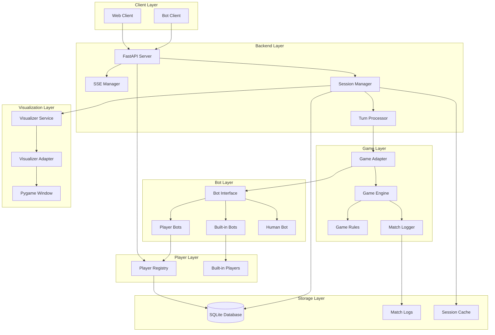
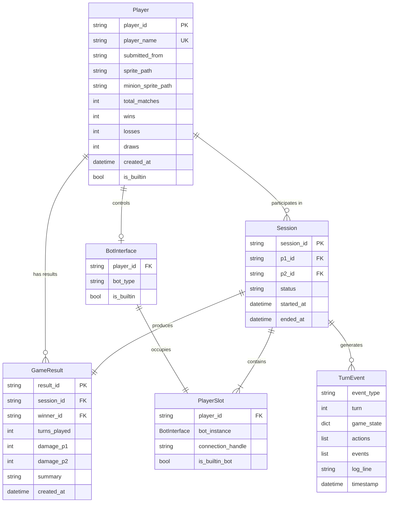
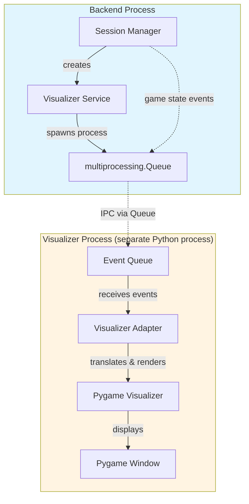

# Spellcasters Playground Backend - Technical Design

## Overview

The Spellcasters Playground Backend is a FastAPI-based real-time multiplayer bot battle system designed for hackathon environments. The system enables participants to register, submit Python bots, and engage in turn-based matches with live streaming via Server-Sent Events (SSE). The backend integrates with the existing game engine while providing comprehensive match logging, replay functionality, and secure bot code execution.

### Assumptions & Decisions

- Rate limiting: none for Playground (hackathon decision)
- Admin audit logging: not implemented; only match logs are persisted
- Player name uniqueness: enforce case-insensitive uniqueness; duplicate registrations return HTTP 409 Conflict

## Architecture

### High-Level Architecture



### Technology Stack

- **Framework**: FastAPI 0.104+ with async/await support
- **Real-time**: Server-Sent Events (SSE) via StreamingResponse
- **Concurrency**: asyncio for session management
- **Database**: SQLite with SQLModel for data persistence and ORM
- **Security**: Restricted execution sandbox for bot code
- **Validation**: Pydantic models for request/response validation
- **Game Engine**: Integration with existing `/game` directory components
- **Logging**: Structured logging with session context

## Data Models

### Domain Entity Relationships



### Player Models

```python
class PlayerRegistration(BaseModel):
    player_name: str = Field(..., min_length=1, max_length=50)
    submitted_from: Literal["online", "upload"] = "online"
    sprite_path: Optional[str] = None
    minion_sprite_path: Optional[str] = None

class Player(BaseModel):
    """Encapsulates visible details: ID, name, sprite, game stats"""
    player_id: str = Field(..., description="Slug from player_name (e.g., 'kevin-lin')")
    player_name: str
    submitted_from: str
    sprite_path: Optional[str] = None
    minion_sprite_path: Optional[str] = None
    total_matches: int = 0
    wins: int = 0
    losses: int = 0
    draws: int = 0
    created_at: datetime
    is_builtin: bool = False  # True for built-in players
```

### Player ID Generation Strategy

Player IDs are generated as human-readable slugs from `player_name`:

1. Convert to lowercase
2. Remove special characters (keep alphanumeric and spaces)
3. Replace spaces with hyphens
4. Handle duplicates with numeric postfix (`_2`, `_3`, etc.)
5. Built-in players use fixed IDs (unchanged)

**Examples:**
- "Kevin Lin" → `kevin-lin`
- "O'Brien!" → `obrien`
- Duplicate "Kevin Lin" → `kevin-lin_2`

**Implementation:** The `DatabaseService._generate_player_slug()` method handles slug generation, and `create_player()` checks for duplicates and adds postfix as needed.

### Player Registry

```python
class PlayerRegistry:
    """Manages all players (both user-registered and built-in)"""
    
    def __init__(self):
        self.players: Dict[str, Player] = {}
        # Pre-register built-in players
        self._register_builtin_players()
    
    def _register_builtin_players(self) -> None:
        """Register all built-in players at startup"""
        for player in BuiltinBotRegistry.BUILTIN_PLAYERS.values():
            self.players[player.player_id] = player
    
    def register_player(self, registration: PlayerRegistration) -> Player:
        """Register a new user player"""
        player = Player(
            player_id=str(uuid4()),
            player_name=registration.player_name,
            submitted_from=registration.submitted_from,
            sprite_path=registration.sprite_path,
            minion_sprite_path=registration.minion_sprite_path,
            created_at=datetime.now()
        )
        self.players[player.player_id] = player
        return player
    
    def get_player(self, player_id: str) -> Optional[Player]:
        """Get player by ID"""
        return self.players.get(player_id)
    
    def update_player_stats(self, player_id: str, result: GameResult) -> None:
        """Update player statistics after a match"""
        player = self.players.get(player_id)
        if player:
            player.total_matches += 1
            if result.winner == player_id:
                player.wins += 1
            elif result.result_type == GameResultType.DRAW:
                player.draws += 1
            else:
                player.losses += 1
    
    def list_players(self, include_builtin: bool = True) -> List[Player]:
        """List all players"""
        if include_builtin:
            return list(self.players.values())
        return [p for p in self.players.values() if not p.is_builtin]
    
    async def delete_player(self, player_id: str) -> bool:
        """Delete a player with validation and constraint checking"""
        # Validate player exists and is not built-in
        # Check for active sessions
        # Cascade delete related game results
        # Remove player from registry
```

### Bot Models

```python
class BotInterface(ABC):
    """
    Standardized interface for all bots (built-in and player).
    Encapsulates in-game execution: game strategy, turn actions etc.
    Maintains strong one-directional reference to Player instance.
    """
    
    def __init__(self, player: Player):
        """Initialize bot with reference to Player instance"""
        self._player = player
    
    @property
    def player(self) -> Player:
        """Get the Player instance this bot represents"""
        return self._player
    
    @property
    def name(self) -> str:
        """Bot identification name (delegates to player)"""
        return self._player.player_name
    
    @property
    def player_id(self) -> str:
        """Unique player ID (delegates to player)"""
        return self._player.player_id
    
    @abstractmethod
    def decide(self, state: Dict[str, Any]) -> Dict[str, Any]:
        """Main decision method called by game engine"""
        pass
    
    @property
    def is_builtin(self) -> bool:
        """Flag indicating if this is a built-in bot"""
        return self._player.is_builtin

class BotCreationRequest(BaseModel):
    """Request to create a new player bot"""
    bot_code: str
    player_id: Optional[str] = None  # If None, must provide player_registration
    player_registration: Optional[PlayerRegistration] = None

class BotInfo(BaseModel):
    """Information about available bots"""
    bot_type: Literal["builtin", "player"]
    bot_id: str
    player_id: str
    player_name: str
    description: Optional[str] = None
    difficulty: Optional[str] = None  # For built-in bots
```

### Game State Models

```python
class GameState(BaseModel):
    session_id: str
    player_1: PlayerSlot
    player_2: PlayerSlot
    current_game_state: Dict[str, Any]
    match_log: List[str]
    turn_index: int
    status: TurnStatus
    created_at: datetime
    last_activity: datetime

class PlayerSlot(BaseModel):
    """Represents a slot in a game session"""
    player_id: str  # References Player.player_id
    bot_instance: BotInterface  # Bot instance that references the player
    connection_handle: Optional[str] = None  # SSE connection ID for human players
    is_builtin_bot: bool = False  # True if using built-in bot

class TurnStatus(str, Enum):
    WAITING = "waiting"
    ACTIVE = "active"
    COMPLETED = "completed"
    CANCELLED = "cancelled"
```

### Game Action Models

```python
class Move(BaseModel):
    """Represent the move made by one player in a single round"""
    player_id: str
    turn: int
    timestamp: datetime
    move: Optional[List[int]]  # [dx, dy]
    spell: Optional[SpellAction]
    result: MoveResult

class SpellAction(BaseModel):
    name: str
    target: Optional[List[int]] = None  # [x, y] for targeted spells

class MoveResult(BaseModel):
    success: bool
    damage_dealt: int = 0
    damage_received: int = 0
    position_after: List[int]  # [x, y]
    events: List[str]  # Descriptive events for this move

class MoveHistory(BaseModel):
    """Capture all the moves made by both players in a game"""
    session_id: str
    moves: List[Move]
    total_turns: int
    
    def get_moves_by_player(self, player_id: str) -> List[Move]:
        """Get all moves for a specific player"""
        return [move for move in self.moves if move.player_id == player_id]
    
    def get_moves_by_turn(self, turn: int) -> List[Move]:
        """Get all moves for a specific turn"""
        return [move for move in self.moves if move.turn == turn]
```

### Game Result Models

```python
class GameResult(BaseModel):
    """The outcome of the game and other stats"""
    session_id: str
    winner: Optional[str]  # player_id of winner, None for draw
    loser: Optional[str]   # player_id of loser, None for draw
    result_type: GameResultType
    total_rounds: int
    first_player: str  # player_id of who started first
    game_duration: float  # Duration in seconds
    final_scores: Dict[str, PlayerGameStats]
    end_condition: str  # "hp_zero", "max_turns", "timeout", "forfeit"
    created_at: datetime

class GameResultType(str, Enum):
    WIN = "win"
    LOSS = "loss"
    DRAW = "draw"

class PlayerGameStats(BaseModel):
    player_id: str
    final_hp: int
    final_mana: int
    final_position: List[int]
    damage_dealt: int
    damage_received: int
    spells_cast: int
    artifacts_collected: int
```

### Turn Event Models

```python
class TurnEvent(BaseModel):
    event: Literal["turn_update"] = "turn_update"
    turn: int
    game_state: Dict[str, Any]
    actions: List[MoveResult]
    events: List[str]
    log_line: str

class GameOverEvent(BaseModel):
    event: Literal["game_over"] = "game_over"
    winner: Optional[str]
    final_state: Dict[str, Any]
    game_result: GameResult

class PlayerTurnResult(BaseModel):
    player_id: str
    action: Move
    result: MoveResult
```

### Error Models

```python
class ErrorResponse(BaseModel):
    error: str
    message: str
    details: Optional[Dict[str, Any]] = None
    session_id: Optional[str] = None

class TimeoutError(PlaygroundError):
    """Operation timed out"""
```

### Database Models (SQLModel)

```python
class PlayerDB(SQLModel, table=True):
    """Database model for persistent player storage"""
    __tablename__ = "players"
    
    player_id: str = Field(primary_key=True)
    player_name: str = Field(index=True)
    submitted_from: str
    sprite_path: Optional[str] = None
    minion_sprite_path: Optional[str] = None
    total_matches: int = 0
    wins: int = 0
    losses: int = 0
    draws: int = 0
    created_at: datetime = Field(default_factory=datetime.now)
    is_builtin: bool = False

class SessionDB(SQLModel, table=True):
    """Database model for session persistence"""
    __tablename__ = "sessions"
    
    session_id: str = Field(primary_key=True)
    player_1_id: str = Field(foreign_key="players.player_id")
    player_2_id: str = Field(foreign_key="players.player_id")
    status: str
    created_at: datetime = Field(default_factory=datetime.now)
    completed_at: Optional[datetime] = None
    winner_id: Optional[str] = None

class GameResultDB(SQLModel, table=True):
    """Database model for persistent game results"""
    __tablename__ = "game_results"
    
    session_id: str = Field(primary_key=True, foreign_key="sessions.session_id")
    winner_id: Optional[str] = Field(foreign_key="players.player_id")
    loser_id: Optional[str] = Field(foreign_key="players.player_id")
    result_type: str
    total_rounds: int
    game_duration: float
    end_condition: str
    created_at: datetime = Field(default_factory=datetime.now)
```

### Core Data Storage

```python
# Database (SQLite with SQLModel)
# Note: the path is resolved to an absolute path based on the repository root
database_service: DatabaseService = DatabaseService("sqlite:///<repo_root>/data/playground.db")

# In-Memory Cache for Active Sessions
sessions: Dict[str, GameState] = {}

# Match Logs (File-based)
# logs/playground/{session_id}.log

# SSE Connections (In-Memory)
sse_connections: Dict[str, List[SSEConnection]] = {}
```

### State Management

```python
### Database Service

```python
class DatabaseService:
    """Centralized database operations for all models"""
    
    def __init__(self, database_url: str = "sqlite:///./data/playground.db"):
        # Implementation resolves relative URLs to an absolute path rooted at the repository
        self.engine = create_engine(database_url)
        SQLModel.metadata.create_all(self.engine)
    
    async def create_player(self, player: Player) -> PlayerDB:
        """Persist player to database"""
        
    async def get_player(self, player_id: str) -> Optional[PlayerDB]:
        """Retrieve player from database"""
        
    async def update_player_stats(self, player_id: str, result: GameResult) -> None:
        """Update player statistics in database"""
        
    async def list_all_players(self) -> List[PlayerDB]:
        """List all players for admin endpoint"""
        
    async def create_session_record(self, session: GameState) -> SessionDB:
        """Create session record in database"""
        
    async def get_active_sessions(self) -> List[SessionDB]:
        """Get all active sessions for admin endpoint"""
        
    async def complete_session(self, session_id: str, result: GameResult) -> None:
        """Mark session as completed and store result"""
        
    async def delete_player(self, player_id: str) -> bool:
        """Delete a player with constraint validation and cascade delete"""
```

### State Management

```python
class StateManager:
    """Centralized state management for all backend components"""
    
    def __init__(self):
        self.database = DatabaseService()  # Database persistence
        self.player_registry = PlayerRegistry(self.database)  # Manages both user and built-in players
        self.sessions = SessionRegistry()  # In-memory active sessions
        self.connections = SSEConnectionManager()
        self.admin_service = AdminService(self.database)
    
    async def cleanup_expired_sessions(self) -> None:
        """Periodic cleanup of inactive sessions"""
    
    async def get_system_stats(self) -> SystemStats:
        """Get current system statistics"""
    
    def create_bot(self, request: BotCreationRequest) -> BotInterface:
        """Create bot instance with proper player reference"""
        return PlayerBotFactory.create_bot(request, self.player_registry)
    
    def get_builtin_bot(self, bot_id: str) -> BotInterface:
        """Get built-in bot instance"""
        return BuiltinBotRegistry.create_bot(bot_id)
```

### Admin Management System

#### Admin Service Component

```python
class AdminService:
    """Service for administrative operations"""
    
    def __init__(self, db_service: DatabaseService, session_manager: SessionManager):
        self.db = db_service
        self.session_manager = session_manager
    
    async def list_all_players(self) -> List[AdminPlayerInfo]:
        """Get all players with statistics for admin view"""
        
    async def get_active_sessions(self) -> List[AdminSessionInfo]:
        """Get all currently active playground sessions"""
        
    async def cleanup_session(self, session_id: str) -> bool:
        """Administratively terminate a session"""

class AdminPlayerInfo(BaseModel):
    """Player information for admin endpoints"""
    player_id: str
    player_name: str
    submitted_from: str
    total_matches: int
    wins: int
    losses: int
    draws: int
    win_rate: float
    created_at: datetime
    is_builtin: bool

class AdminSessionInfo(BaseModel):
    """Session information for admin endpoints"""
    session_id: str
    player_1_name: str
    player_2_name: str
    status: str
    turn_index: int
    duration_minutes: float
    created_at: datetime
    last_activity: datetime
```

#### Admin API Endpoints

```python
@app.get("/admin/players", response_model=List[AdminPlayerInfo])
async def list_all_players() -> List[AdminPlayerInfo]:
    """List all registered players with statistics"""

@app.get("/playground/active", response_model=List[AdminSessionInfo])  
async def list_active_sessions() -> List[AdminSessionInfo]:
    """List all currently active playground sessions"""

@app.delete("/playground/{session_id}")
async def cleanup_session(session_id: str) -> Dict[str, str]:
    """Administratively cleanup a session"""
```

## Components and Interfaces

### 1. Player Registration

#### API Endpoints

```python
@app.post("/players/register", response_model=Player)
async def register_player(registration: PlayerRegistration) -> Player:
    """Register a new player and return player data with generated player_id"""

@app.delete("/players/{player_id}", status_code=204)
async def delete_player(player_id: str) -> None:
    """Delete a registered player and cascade delete related game results"""
```

#### Behavior

- Enforce case-insensitive uniqueness for `player_name` at registration time.
- On duplicate `player_name` (case-insensitive), return `409 Conflict`.

#### Storage Design

- **In-Memory Storage**: Dictionary-based player registry
- **Thread Safety**: asyncio locks for concurrent access
- **Data Persistence**: Players stored for session duration
- **Statistics Tracking**: Real-time win/loss/draw updates

### 2. Built-in Bot System

#### Built-in Bot Registry

```python
class BuiltinBotRegistry:
    """Registry and factory for built-in bots with their default players"""
    
    # Built-in players (hard-coded)
    BUILTIN_PLAYERS = {
        "builtin_sample_1": Player(
            player_id="builtin_sample_1",
            player_name="Sample Bot 1",
            submitted_from="builtin",
            sprite_path="assets/wizards/sample_bot1.png",
            minion_sprite_path="assets/minions/minion_1.png",
            is_builtin=True,
            created_at=datetime.now()
        ),
        "builtin_tactical": Player(
            player_id="builtin_tactical",
            player_name="Tactical Bot",
            submitted_from="builtin",
            sprite_path="assets/wizards/tactical_bot.png",
            minion_sprite_path="assets/minions/tactical_minion.png",
            is_builtin=True,
            created_at=datetime.now()
        )
    }
    
    # Built-in bot configurations
    BUILTIN_BOTS = {
        "sample_bot_1": {
            "player_id": "builtin_sample_1",
            "bot_class": SampleBot1,
            "difficulty": "easy",
            "description": "A simple bot for beginners"
        },
        "tactical_bot": {
            "player_id": "builtin_tactical", 
            "bot_class": TacticalBot,
            "difficulty": "medium",
            "description": "An advanced tactical bot"
        }
    }
    
    @classmethod
    def get_builtin_player(cls, player_id: str) -> Player:
        """Get built-in player instance"""
        if player_id not in cls.BUILTIN_PLAYERS:
            raise ValueError(f"Built-in player {player_id} not found")
        return cls.BUILTIN_PLAYERS[player_id]
    
    @classmethod
    def create_bot(cls, bot_id: str) -> BotInterface:
        """Create built-in bot instance with its default player"""
        if bot_id not in cls.BUILTIN_BOTS:
            raise ValueError(f"Built-in bot {bot_id} not found")
        
        config = cls.BUILTIN_BOTS[bot_id]
        player = cls.get_builtin_player(config["player_id"])
        bot_class = config["bot_class"]
        
        return bot_class(player)
    
    @classmethod
    def list_available_bots(cls) -> List[BotInfo]:
        """List all available built-in bots"""
        bots = []
        for bot_id, config in cls.BUILTIN_BOTS.items():
            player = cls.get_builtin_player(config["player_id"])
            bots.append(BotInfo(
                bot_type="builtin",
                bot_id=bot_id,
                player_id=player.player_id,
                player_name=player.player_name,
                description=config.get("description"),
                difficulty=config.get("difficulty")
            ))
        return bots
```

#### Player Bot Implementation

Player-submitted bots must conform to the same `BotInterface` as built-in bots and reference an existing Player:

```python
class PlayerBot(BotInterface):
    """
    Remote player bot implementation.
    Waits for action submission via HTTP API endpoint and returns the submitted action.
    Encapsulates in-game execution with strong reference to Player instance.
    """

    def __init__(self, player: Player):
        """Initialize with Player instance."""
        super().__init__(player)  # Initialize base class with player reference
        self._last_action: Optional[ActionData] = None

    def set_action(self, action: ActionData) -> None:
        """Store the action submitted via HTTP API for the next turn."""
        self._last_action = action

    def decide(self, state: Dict[str, Any]) -> Dict[str, Any]:
        """Return the last submitted action, or no-op if none submitted."""
        if self._last_action is None:
            return {"move": [0, 0], "spell": None}

        action = self._last_action
        # Convert ActionData to game engine format
        result = {"move": action.move if action.move else [0, 0], "spell": None}

        if action.spell:
            result["spell"] = action.spell

        return result

class PlayerBotFactory:
    """Factory for creating player bots with proper player references"""
    
    @staticmethod
    def create_bot(request: BotCreationRequest, player_registry: 'PlayerRegistry') -> PlayerBot:
        """
        Create a player bot with reference to existing or new player.
        
        User can choose to:
        1. Reuse existing Player (provide player_id)
        2. Register new Player (provide player_registration) - fresh stats
        """
        if request.player_id:
            # Option 1: Reuse existing player
            player = player_registry.get_player(request.player_id)
            if not player:
                raise ValueError(f"Player {request.player_id} not found")
        elif request.player_registration:
            # Option 2: Register new player for fresh stats
            player = player_registry.register_player(request.player_registration)
        else:
            raise ValueError("Must provide either player_id or player_registration")

        # Create PlayerBot for remote action submission
        # Note: bot_code parameter is deprecated and ignored
        return PlayerBot(player)
```

**Key Requirements for Player Bots**:
1. Must implement all required `BotInterface` methods
2. Must return actions in the same format as built-in bots
3. Must handle the same game state structure as built-in bots
4. Must execute within timeout and resource constraints
5. Remote player bots store actions via `set_action()` and return them via `decide()`
6. The `bot_type` field in `PlayerConfig` determines bot creation:
   - `bot_type="builtin"`: Creates built-in bot that executes its own logic
   - `bot_type="player"`: Creates PlayerBot that waits for HTTP action submission

#### Human Player Support

The backend supports human players who submit actions via HTTP endpoints rather than automated bot logic:

```python
class HumanBot(BotInterface):
    """Human-controlled bot that plays the last submitted action"""

    def __init__(self, player: Player):
        super().__init__(player)
        self._last_action: Optional[ActionData] = None

    def set_action(self, action: ActionData) -> None:
        """Set the action for the next turn (called by action endpoint)"""
        self._last_action = action

    def decide(self, state: Dict[str, Any]) -> Dict[str, Any]:
        """Return the last submitted action, or no-op if none submitted"""
        if self._last_action is None:
            return {"move": [0, 0], "spell": None}
        action = self._last_action
        return {"move": action.move, "spell": action.spell}
```

**Human Player Workflow**:
1. Player registers via `/players/register`
2. Session created with `is_human: true` in player config
3. Human player submits actions via `POST /playground/{session_id}/action`
4. Actions are stored in `HumanBot` instance and retrieved during turn processing
5. If no action submitted within timeout, default no-op action is used

**Configuration**:
```json
{
  "player_1_config": {
    "player_id": "uuid-of-registered-player",
    "bot_type": "player",
    "is_human": true
  },
  "player_2_config": {
    "player_id": "builtin_sample_1",
    "bot_type": "builtin",
    "bot_id": "sample_bot_1",
    "is_human": false
  }
}
```

### 3. Session Management System

#### Session Manager Component

```python
class SessionManager:
    def __init__(self):
        self.sessions: Dict[str, GameState] = {}
        self.match_loops: Dict[str, asyncio.Task] = {}
        self.sse_connections: Dict[str, List[SSEConnection]] = {}
    
    async def create_session(self, player_configs: List[PlayerConfig]) -> str
    async def start_match_loop(self, session_id: str) -> None
    async def add_sse_connection(self, session_id: str, connection: SSEConnection) -> None
    async def submit_action(self, session_id: str, player_id: str, action: Move) -> None
    async def cleanup_session(self, session_id: str) -> None
```

### 4. Real-time Match Streaming (SSE)

#### SSE Implementation

```python
async def stream_match_events(session_id: str, request: Request) -> StreamingResponse:
    """Stream real-time match events via SSE"""
    
    async def event_generator():
        connection = SSEConnection(session_id, request)
        try:
            await session_manager.add_sse_connection(session_id, connection)
            
            while not await request.is_disconnected():
                event = await connection.wait_for_event(timeout=30.0)
                if event:
                    yield f"data: {event.json()}\n\n"
                else:
                    # Heartbeat
                    yield "data: {\"event\": \"heartbeat\"}\n\n"
                    
        except asyncio.CancelledError:
            await session_manager.remove_sse_connection(session_id, connection)
    
    return StreamingResponse(
        event_generator(),
        media_type="text/event-stream",
        headers={
            "Cache-Control": "no-cache",
            "Connection": "keep-alive",
            "X-Accel-Buffering": "no"  # Nginx optimization
        }
    )
```

### 5. Game Engine Integration

#### Game Engine Adapter

```python
class GameEngineAdapter:
    """Adapter between backend and existing game engine"""
    
    def __init__(self):
        self.engine = None
    
    def initialize_match(self, bot1: BotInterface, bot2: BotInterface) -> GameEngine:
        """Initialize game engine with bot instances"""
        
    def execute_turn(self, actions: List[Move]) -> TurnResult:
        """Execute a single turn with player actions"""
        
    def get_game_state(self) -> Dict[str, Any]:
        """Get current game state for SSE streaming"""
        
    def check_game_over(self) -> Optional[GameResult]:
        """Check if game has ended and return result"""
```

#### Integration Modifications

- **Async Compatibility**: Modify game engine to support async operation
- **State Extraction**: Add methods to extract game state for SSE streaming
- **Action Validation**: Integrate backend action validation with game rules
- **Logging Integration**: Connect game logger with match logging system

### 6. Visualization System

The backend includes optional Pygame visualization support for real-time match rendering. The visualization system uses a multiprocessing architecture to isolate Pygame from the async backend.

#### Architecture Overview



#### VisualizerService Component

```python
class VisualizerService:
    """Manages Pygame visualizer process lifecycle"""

    def __init__(self, max_visualized_sessions: int = 10):
        self.max_sessions = max_visualized_sessions
        self.active_visualizers: Dict[str, VisualizerProcess] = {}
        self._lock = asyncio.Lock()

    async def create_visualizer(
        self,
        session_id: str,
        player1_name: str,
        player2_name: str,
        player1_sprite: Optional[str] = None,
        player2_sprite: Optional[str] = None,
    ) -> Tuple[multiprocessing.Process, multiprocessing.Queue]:
        """Create a new visualizer process for a session"""

    async def send_game_state(
        self, session_id: str, game_state: Dict[str, Any]
    ) -> None:
        """Send game state update to visualizer process"""

    async def cleanup_visualizer(self, session_id: str) -> None:
        """Terminate visualizer process and cleanup resources"""

    def can_create_visualizer(self) -> bool:
        """Check if we can create a new visualizer (under limit)"""
        return len(self.active_visualizers) < self.max_sessions
```

#### VisualizerAdapter Component

```python
class VisualizerAdapter:
    """Bridges backend events to Pygame visualizer format"""

    def __init__(
        self,
        session_id: str,
        event_queue: multiprocessing.Queue,
        player1_name: str,
        player2_name: str,
        player1_sprite: Optional[str] = None,
        player2_sprite: Optional[str] = None,
    ):
        self._session_id = session_id
        self._queue = event_queue
        self._player1_name = player1_name
        self._player2_name = player2_name
        self._player1_sprite = player1_sprite
        self._player2_sprite = player2_sprite
        self._visualizer = None  # Pygame visualizer instance
        self._running = True

    def initialize_visualizer(self) -> None:
        """Initialize Pygame and create Visualizer instance"""
        # Import pygame here to avoid import in main process
        import pygame
        from simulator.visualizer import Visualizer

        pygame.init()
        self._visualizer = Visualizer(
            player1_name=self._player1_name,
            player2_name=self._player2_name,
            # ... sprite paths, etc.
        )

    def run(self) -> None:
        """Main loop: receive events from queue and render to Pygame"""
        self.initialize_visualizer()

        while self._running:
            try:
                # Check for shutdown signal
                try:
                    event = self._queue.get(timeout=0.1)
                    if event == "SHUTDOWN":
                        break
                    elif isinstance(event, dict):
                        self._handle_game_state(event)
                except queue.Empty:
                    pass

                # Handle Pygame events (window close, etc.)
                self._handle_pygame_events()

                # Render current state
                self._visualizer.render()

            except Exception as e:
                logger.error(f"Visualizer error: {e}")
                break

        self.cleanup()

    def _handle_game_state(self, state: Dict[str, Any]) -> None:
        """Translate backend game state to Pygame visualizer format"""
        # Convert backend state format to visualizer format
        # Update visualizer with new state

    def _handle_pygame_events(self) -> None:
        """Handle Pygame window events"""
        import pygame

        for event in pygame.event.get():
            if event.type == pygame.QUIT:
                self._running = False

    def cleanup(self) -> None:
        """Cleanup Pygame resources"""
        import pygame

        pygame.quit()
```

#### Process Lifecycle

**Startup**:
1. SessionManager receives `visualize=true` in session creation request
2. SessionManager calls `VisualizerService.create_visualizer()`
3. VisualizerService spawns new `multiprocessing.Process` running `VisualizerAdapter.run()`
4. Pygame window opens in visualizer process

**During Match**:
1. After each turn, SessionManager sends game state to visualizer queue
2. VisualizerAdapter receives state from queue
3. Adapter translates backend format to Pygame visualizer format
4. Visualizer renders updated state to Pygame window

**Shutdown**:
1. Match ends or session is cleaned up
2. SessionManager sends "SHUTDOWN" signal to visualizer queue
3. VisualizerAdapter exits main loop and calls cleanup()
4. Pygame window closes
5. Visualizer process terminates

#### Configuration

Visualization behavior is controlled via environment variables:

```python
class Settings(BaseSettings):
    # Visualization
    enable_visualization: bool = True
    max_visualized_sessions: int = 10
    visualizer_queue_size: int = 100
    visualizer_shutdown_timeout: float = 5.0
    visualizer_animation_duration: float = 0.5
    visualizer_initial_render_delay: float = 0.3
```

#### Integration with SessionManager

```python
class SessionManager:
    async def create_session(
        self,
        player_1: PlayerConfig,
        player_2: PlayerConfig,
        visualize: bool = False
    ) -> str:
        """Create a new session and optionally spawn visualizer"""

        session_id = str(uuid4())

        # ... create session logic ...

        # Spawn visualizer if requested
        if visualize and self._visualizer_service.can_create_visualizer():
            visualizer_process, visualizer_queue = await self._visualizer_service.create_visualizer(
                session_id=session_id,
                player1_name=bot1.name,
                player2_name=bot2.name,
                player1_sprite=bot1.player.sprite_path,
                player2_sprite=bot2.player.sprite_path,
            )
            # Store visualizer references in session context
            session_context.visualizer_process = visualizer_process
            session_context.visualizer_queue = visualizer_queue
            session_context.visualizer_enabled = True

        return session_id

    async def _send_to_visualizer(self, session_id: str, game_state: Dict) -> None:
        """Send game state update to visualizer if enabled"""
        session = self.get_session(session_id)
        if session.visualizer_enabled and session.visualizer_queue:
            try:
                session.visualizer_queue.put_nowait(game_state)
            except queue.Full:
                logger.warning(f"Visualizer queue full for session {session_id}")
```

#### Limitations and Considerations

**Display Requirements**:
- Requires X11/Wayland (Linux), macOS window server, or Windows display
- Headless environments: Set `PLAYGROUND_ENABLE_VISUALIZATION=false`
- CI/CD: Visualizer tests use mocked Pygame to avoid display requirements

**Resource Management**:
- Each visualizer spawns a separate Python process
- Limited to `max_visualized_sessions` concurrent visualizers (default: 10)
- Process cleanup on session end prevents resource leaks

**Process Isolation**:
- Pygame runs in separate process to avoid conflicts with asyncio
- Communication via `multiprocessing.Queue` (one-way: backend → visualizer)
- Visualizer errors don't crash main backend process

**Performance**:
- Minimal impact on match performance (async queue operations)
- Event queue size limits memory usage
- Visualizer process can be terminated without affecting match

### 7. Player Action Processing

#### Turn Processing Pipeline

```python
class TurnProcessor:
    """Processes player actions and coordinates turn execution"""
    
    def __init__(self, timeout_seconds: float = 5.0):
        self.timeout = timeout_seconds
        self.pending_actions: Dict[str, Dict[str, Move]] = {}
    
    async def collect_actions(self, session_id: str, expected_players: List[str]) -> Dict[str, Move]:
        """Collect actions from all players with timeout"""
    
    async def validate_action(self, action: Move, game_state: Dict[str, Any]) -> bool:
        """Validate action against current game rules"""
    
    async def process_turn(self, session_id: str, actions: Dict[str, Move]) -> TurnResult:
        """Process complete turn with all player actions"""
```

## Error Handling

### Global Error Handlers

```python
@app.exception_handler(SessionNotFoundError)
async def session_not_found_handler(request: Request, exc: SessionNotFoundError):
    return JSONResponse(
        status_code=404,
        content=ErrorResponse(
            error="SESSION_NOT_FOUND",
            message="The requested session does not exist"
        ).dict()
    )

@app.exception_handler(BotExecutionError)
async def bot_execution_error_handler(request: Request, exc: BotExecutionError):
    # Log security incident
    logger.warning(f"Bot execution error: {exc}", extra={"security": True})
    return JSONResponse(
        status_code=400,
        content=ErrorResponse(
            error="BOT_EXECUTION_ERROR",
            message="Error executing bot code"
        ).dict()
    )
```

## Testing Strategy

### Unit Testing

```python
# Test structure
tests/
├── unit/
│   ├── test_player_registration.py
│   ├── test_session_manager.py
│   ├── test_bot_evaluator.py
│   ├── test_game_engine_adapter.py
│   └── test_sse_streaming.py
└── integration/
    ├── test_full_match_flow.py
    ├── test_builtin_bots.py
    └── test_concurrent_sessions.py
```

### Testing Frameworks and Tools

- **pytest**: Primary testing framework
- **pytest-asyncio**: For async test support
- **httpx**: For API endpoint testing
- **websockets**: For SSE connection testing
- **mock**: For component isolation
- **coverage**: Code coverage measurement

### Test Categories

1. **Unit Tests**: Individual component testing
2. **Integration Tests**: Full workflow testing

### Mock Strategies

```python
# Mock built-in bots for testing
class MockBot(BotInterface):
    def __init__(self, name: str, decisions: List[Dict]):
        self._name = name
        self.decisions = iter(decisions)
    
    def decide(self, state: Dict[str, Any]) -> Dict[str, Any]:
        return next(self.decisions, {"move": [0, 0], "spell": None})

# Mock SSE connections
class MockSSEConnection:
    def __init__(self, session_id: str):
        self.session_id = session_id
        self.events = asyncio.Queue()
    
    async def send_event(self, event: Dict) -> None:
        await self.events.put(event)
```

## Security Considerations

### Bot Execution

1. **Interface Compliance**: All player bots must conform to the BotInterface
2. **Timeout Enforcement**: Prevent infinite loops and CPU burning
3. **Error Handling**: Graceful handling of bot execution errors

### Input Validation

1. **Request Validation**: Pydantic models for all inputs
2. **Input Validation**: Validate bot actions against game rules

## Development Guidelines

### Code Organization

```
backend/
├── app/
│   ├── __init__.py
│   ├── main.py              # FastAPI application
│   ├── api/
│   │   ├── __init__.py
│   │   ├── players.py       # Player endpoints
│   │   ├── sessions.py      # Session endpoints
│   │   └── streaming.py     # SSE endpoints
│   ├── core/
│   │   ├── __init__.py
│   │   ├── config.py        # Configuration
│   │   ├── security.py      # Security utilities
│   │   └── exceptions.py    # Custom exceptions
│   ├── models/
│   │   ├── __init__.py
│   │   ├── players.py       # Player models
│   │   ├── sessions.py      # Session models
│   │   └── events.py        # SSE event models
│   ├── services/
│   │   ├── __init__.py
│   │   ├── session_manager.py
│   │   ├── bot_evaluator.py
│   │   └── game_adapter.py
│   └── utils/
│       ├── __init__.py
│       ├── logging.py
│       └── validation.py
├── tests/
├── logs/
└── requirements.txt

client/
├── __init__.py
├── sse_client.py           # SSE client library
├── sse_client_main.py      # CLI: stream events from a session
├── bot_client.py           # Bot client simulator library
└── bot_client_main.py      # CLI: register player, start match vs built-in, stream events
```

### Code Quality Standards

- **Type Hints**: Full type annotation for all functions
- **Documentation**: Comprehensive docstrings
- **Linting**: Black formatting and pylint compliance
- **Security**: Regular security reviews