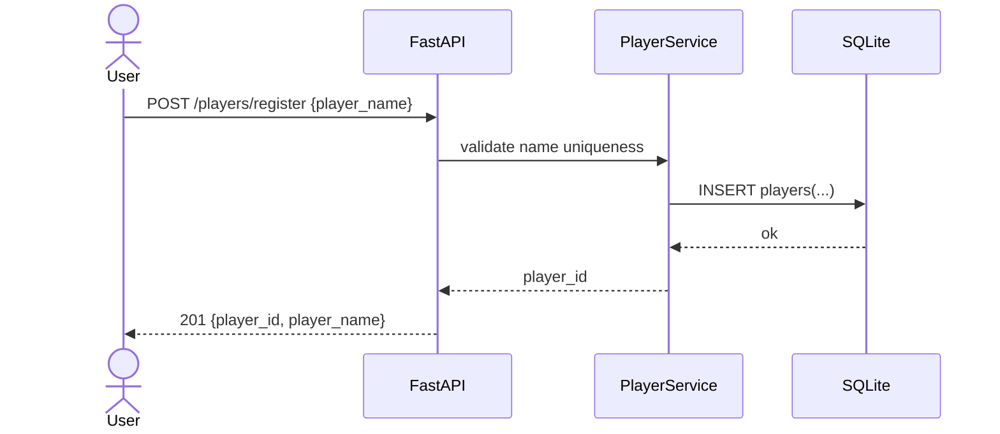
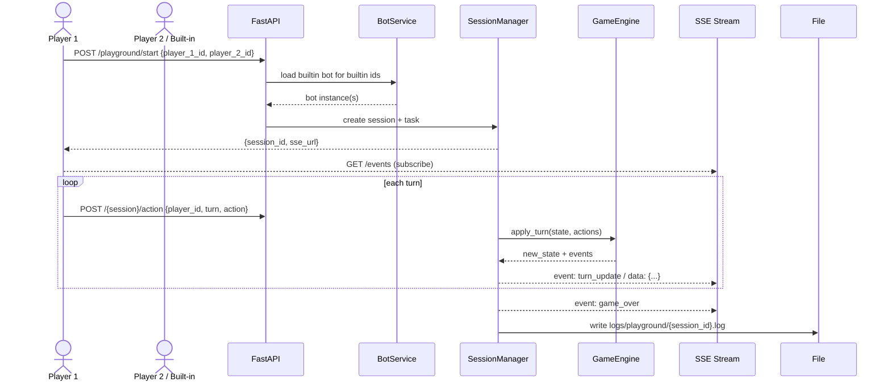

# Spellcasters Backend Functional Specification (SWEX 2025 Hackathon)

> **Status:** Review draft — consolidated from v1/v2/v3. All prior open questions resolved on **Aug 10, 2025** (Asia/Singapore). **Scope is Playground only**; Tournament features are deferred to a separate spec. Some DB tables are reserved for future Tournament support (see §3.4).

---

## 0. Purpose & Scope

This document specifies the backend for the **Spellcasters** hackathon project (Playground only). It covers:

* Player registration and identity
* Built‑in bots (no upload API in this version)
* **Playground** (adhoc 1v1 arena) matches
* Persistence, APIs, data models, and event flows (SSE)
* Operational, logging, and testing requirements

**Out of scope for this doc**: Tournament orchestration and endpoints (a separate spec will define those). Authentication/authorization remains out of scope for the hackathon.

---

## 1. Final Assumptions & Decisions

* **Admin auth:** **None** for hackathon (no bearer token).
* **Rate limiting:** **None** for now (including `/action`).
* **Bot execution time:** **100 ms** per `decide()` (soft budget); turn/action hard timeout **`TURN_TIMEOUT_SECONDS = 5`** seconds.
* **Replay retention:** **In‑memory only** until session cleanup (no DB replay table).
* **Built‑in bots (IDs per design):**

  * Player IDs: `builtin_sample_1`, `builtin_tactical`
  * Bot classes: `sample_bot_1`, `tactical_bot`
* **Persistence:** **SQLite** via **SQLModel**. Database file is **`data/playground.db`** resolved to an **absolute path** from repo root.

---

## 2. Architecture Overview

**Language/Framework:** Python 3.10+, **FastAPI**. Async I/O for HTTP/SSE. Game engine is deterministic per turn, fed by two `BotAction`s.

**Key components**

* **PlayerService** — register players, maintain stats.
* **BotService** — manage **built‑in** bot instances/factories (no upload endpoints).
* **SessionManager** — create/run/cleanup Playground match sessions, hold in‑memory state, emit SSE.
* **StateManager** — expose process/state metrics for admin views.
* **GameEngine** — pure functions applying simultaneous actions to `GameState`.
* **Storage** — SQLite via **SQLModel**; filesystem for match log files.

**Concurrency model**: each active match runs in its own `asyncio.Task`; within a match, logic is single‑threaded. Calls to untrusted bot `decide()` are executed in a dedicated `ThreadPoolExecutor` (one worker per session) to avoid blocking the event loop.

---

## 3. Data Model (SQLite, SQLModel)

> Use **SQLModel** models (Pydantic v2) to initialize schema. All timestamps in UTC. DB file path: `data/playground.db` (absolute).

### 3.1 Players

```
players(
  player_id           TEXT PRIMARY KEY,  -- UUIDv4
  player_name         TEXT UNIQUE NOT NULL,
  is_builtin          INTEGER NOT NULL DEFAULT 0,    -- 0/1 boolean
  sprite_path         TEXT,                           -- optional asset hint
  minion_sprite_path  TEXT,                           -- optional asset hint
  submitted_from      TEXT,                           -- e.g. "online", "seed"
  total_matches       INTEGER NOT NULL DEFAULT 0,
  wins                INTEGER NOT NULL DEFAULT 0,
  losses              INTEGER NOT NULL DEFAULT 0,
  draws               INTEGER NOT NULL DEFAULT 0,
  created_at          TEXT NOT NULL,
  updated_at          TEXT NOT NULL
)
```

### 3.2 Sessions (Playground)

```
sessions(
  session_id   TEXT PRIMARY KEY, -- UUIDv4
  p1_id        TEXT NOT NULL REFERENCES players(player_id) ON DELETE CASCADE,
  p2_id        TEXT NOT NULL REFERENCES players(player_id) ON DELETE CASCADE,
  status       TEXT NOT NULL CHECK (status IN ('running','completed','aborted')),
  started_at   TEXT,
  ended_at     TEXT
)
```

### 3.3 Game Results

```
game_results(
  result_id    TEXT PRIMARY KEY, -- UUIDv4
  session_id   TEXT NOT NULL REFERENCES sessions(session_id) ON DELETE CASCADE,
  winner_id    TEXT,             -- NULL for draw
  turns_played INTEGER,
  damage_p1    INTEGER,
  damage_p2    INTEGER,
  summary      TEXT,
  created_at   TEXT NOT NULL
)
```

### 3.4 Tournaments (Reserved for future spec)

```
tournaments(
  tournament_id TEXT PRIMARY KEY, -- UUIDv4
  name          TEXT NOT NULL,
  status        TEXT NOT NULL CHECK (status IN ('draft','ready','running','completed')),
  created_at    TEXT NOT NULL,
  updated_at    TEXT NOT NULL
)

tournament_players(
  tournament_id TEXT NOT NULL REFERENCES tournaments(tournament_id) ON DELETE CASCADE,
  player_id     TEXT NOT NULL REFERENCES players(player_id) ON DELETE CASCADE,
  PRIMARY KEY (tournament_id, player_id)
)

matches(
  match_id      TEXT PRIMARY KEY, -- UUIDv4
  tournament_id TEXT REFERENCES tournaments(tournament_id),
  p1_id         TEXT NOT NULL,
  p2_id         TEXT NOT NULL,
  scheduled_ord INTEGER,
  status        TEXT NOT NULL CHECK (status IN ('pending','running','completed','aborted')),
  winner_id     TEXT,
  turns_played  INTEGER,
  started_at    TEXT,
  ended_at      TEXT
)
```

> Tables present for forward‑compatibility; Tournament endpoints and flows are **not** part of this spec.

---

## 4. Configuration (Env Vars)

| Name                      | Default              | Description                                      |
| ------------------------- | -------------------- | ------------------------------------------------ |
| `TURN_DELAY_SECONDS`      | `1`                  | Delay between processed turns                    |
| `TURN_TIMEOUT_SECONDS`    | `5`                  | Wait for player action before skip               |
| `MAX_TURNS`               | `100`                | Draw threshold                                   |
| `BOT_DECIDE_TIMEOUT_MS`   | `100`                | Max time for `decide()` (per turn).              |
| `PLAYGROUND_IDLE_TTL_MIN` | `30`                 | Keep finished session in memory                  |
| `PLAYGROUND_MAX_SESSIONS` | `50`                 | Safety cap                                       |
| `DB_PATH`                 | `data/playground.db` | Absolute path to SQLite DB (resolved at startup) |

---

## 5. API Specification

All responses are JSON. Errors use `{ "error": { "code": "…", "message": "…" } }` with appropriate HTTP status.

### 5.1 Health & Version

**GET** `/health` → `{ "status": "ok" }`

**GET** `/version` → `{ "version": "0.1.0" }`

### 5.2 Players

**POST** `/players/register`

* Request:

```json
{ "player_name": "FireMage", "submitted_from": "online" }
```

* Rules: `player_name` unique (case‑insensitive). Failure ⇒ 409.
* Response `201 Created`:

```json
{ "player_id": "uuid-v4", "player_name": "FireMage" }
```

**GET** `/players/{player_id}` — returns player metadata and basic stats.

**DELETE** `/players/{player_id}` — delete a player if not builtin and not part of running sessions; cascades `game_results`. Returns `204 No Content`.

### 5.3 Playground (Arena)

**POST** `/playground/start`

* Request:

```json
{ "player_1_id": "uuid-p1", "player_2_id": "builtin_sample_1", "tick_delay_ms": 1000 }
```

* Validates both IDs exist (built‑ins recognized by exact builtin IDs). Creates `session_id`, persists a `sessions` row (and `game_results` after completion), and spawns a match task.
* Response:

```json
{ "session_id": "uuid-session", "sse_url": "/playground/uuid-session/events" }
```

**POST** `/playground/{session_id}/action`

* Request:

```json
{ "player_id": "uuid-p1", "turn": 6, "action": { "move": [1,0], "spell": null } }
```

* Validates: session exists; player belongs to session; `turn == turn_index + 1`. On success, stores pending action.

**GET** `/playground/{session_id}/events` (SSE)

* Emits `event: turn_update` with `data: <json-string>` each turn and finally `event: game_over`.
* `data` example:

```json
{
  "turn": 5,
  "state": { "...": "..." },
  "actions": [ {"player_id": "p1", "resolved": {"move": [1,0]}}, {"player_id": "p2", "resolved": null} ],
  "events": ["p2 timeout"],
  "log_line": "p2 timed out"
}
```

**GET** `/playground/{session_id}/replay`

* Streams recorded turn events with `event: replay_turn` (no delay) if the session is still retained; otherwise 404.

**Admin (hackathon; no auth)**

* `GET /playground/active` — list active sessions.
* `DELETE /playground/{session_id}` — cleanup immediately.
* `GET /admin/players` — list players with stats (and builtin flag).

> **No Bot upload endpoints** in this version; bots are built‑in only.

---

## 6. Session Lifecycle & Engine

### 6.1 In‑Memory Session (per match)

```python
class PlayerSide(TypedDict):
    player_id: str | None  # None for builtin
    bot_instance: BotInterface
    action_source: Literal["builtin", "http"]

class Session(TypedDict):
    session_id: str
    tick_delay_ms: int
    player_1: PlayerSide
    player_2: PlayerSide
    current_state: GameState
    pending_actions: dict[str, BotAction]  # by player_id
    turn_index: int
    event_sinks: list[SSEEmitter]
    match_log: list[str]
    created_at: datetime
```

### 6.2 Loop (per turn)

```
while not game_over and turn_index < MAX_TURNS:
  await collect_actions_or_timeout()
  new_state, events = engine.apply_turn(current_state, pending_actions)
  broadcast_sse_turn(new_state, events)
  pending_actions = {}
  turn_index += 1
  await asyncio.sleep(TURN_DELAY_SECONDS)
```

### 6.3 Bot Execution Isolation

* `decide(state)` executed via `asyncio.to_thread(...)` into a per‑session `ThreadPoolExecutor(max_workers=1)` with wall‑clock limit **BOT\_DECIDE\_TIMEOUT\_MS**. Timeout ⇒ treat as **no action** and log.
* Restricted built‑ins; deny `open`, `import os`, `subprocess`, etc. Whitelist safe modules (`math`, `random`).

### 6.4 End & Stats Update

* `game_over` when any HP ≤ 0 or `MAX_TURNS` reached (draw).
* Update `players` stats: increment `total_matches`; apply win/loss/draw for both.
* Insert `game_results` row; append summary line to `match_log`; write file `logs/playground/{session_id}.log`.
* Keep session in memory for **PLAYGROUND\_IDLE\_TTL\_MIN**.

---

## 7. SSE Event Contract

* Content‑Type: `text/event-stream`; `Cache-Control: no-cache`.
* Each message uses `event: <type>` + `data: <json-string>` (stringified via `json.dumps`).
* Events:

  * `turn_update` —

    ```json
    { "turn": n, "state": {…}, "actions": [{"player_id": "…", "resolved": {…}}, …], "events": ["…"], "log_line": "…" }
    ```
  * `game_over` — `{ "winner": "player_id|null", "reason": "hp_zero|max_turns" }`
  * `replay_turn` — same as `turn_update`, emitted by replay endpoint.

---

## 8. Interaction Diagrams (Key Journeys)

### 8.1 Player Registration — obtain unique Player ID



### 8.2 Playground Game — adhoc 1v1 arena



---

## 9. Error Handling & Edge Cases

* Duplicate player name ⇒ `409 Conflict`.
* Invalid `session_id` / not participant ⇒ `404` / `403`.
* Bad `turn` index ⇒ `400`.
* SSE disconnects: do **not** terminate the match; new subscribers can attach and receive subsequent turns.
* Timeout: missing action after `TURN_TIMEOUT_SECONDS` ⇒ treat as no‑op and log.
* Built‑in bot failures ⇒ log and treat as no action for that turn.

---

## 10. Implementation Notes & Recommendations

* **Frameworks**: FastAPI; `sse-starlette` for SSE helpers; **SQLModel** for SQLite (`DB_PATH` absolute).
* **Sessions**: keep an in‑memory dict protected by `asyncio.Lock`; periodic sweeper cleans up finished sessions after `PLAYGROUND_IDLE_TTL_MIN`.
* **Built‑in bots**: implement local classes (`sample_bot_1`, `tactical_bot`); map to builtin player IDs `builtin_sample_1`, `builtin_tactical`.
* **Security**: restricted globals for user code; deny filesystem and process access.
* **Logging**: plain‑text per‑turn log lines in memory; flush to file at match end.

---

## 11. Testing Matrix

* **Unit**: player registration; duplicate name; engine `apply_turn`; timeout path; stats update; player deletion rules.
* **Integration**: PvE and PvP match; SSE stream consumption; replay; concurrent sessions.
* **Admin**: `/admin/players` returns expected shape; health/version endpoints.
* **Load (lightweight)**: 20 concurrent Playground sessions; ensure event‑loop responsive.

---

## 12. Glossary

* **Playground**: on‑demand 1v1 match (player vs player or built‑in).
* **SSE**: Server‑Sent Events; uni‑directional push over HTTP.
* **Replay**: fast stream of recorded turn events of a finished session retained in memory.
