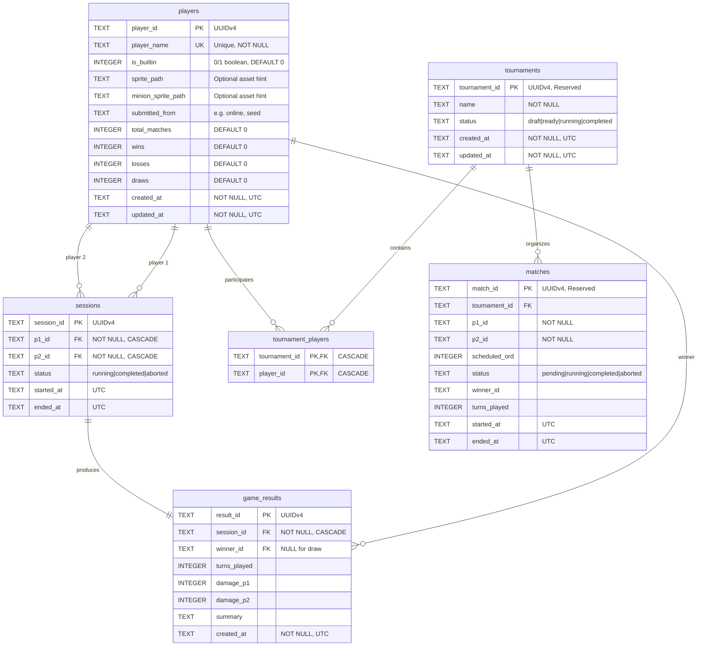
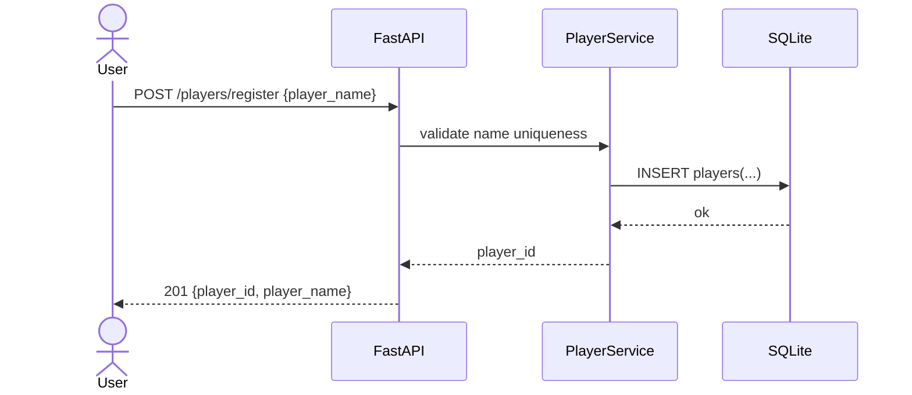
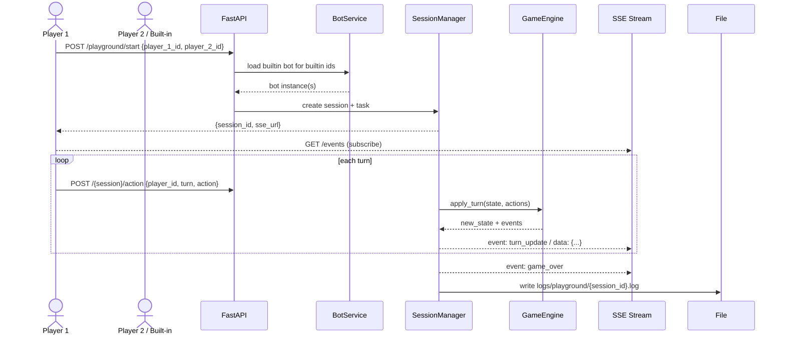

# Spellcasters Backend Functional Specification (SWEX 2025 Hackathon)

> **Status:** Review draft — consolidated from v1/v2/v3. All prior open questions resolved on **Aug 10, 2025** (Asia/Singapore). **Scope is Playground only**; Tournament features are deferred to a separate spec. Some DB tables are reserved for future Tournament support (see §3.4).

---

## 0. Purpose & Scope

This document specifies the backend for the **Spellcasters** hackathon project (Playground only). It covers:

* Player registration and identity
* Built‑in bots (no upload API in this version)
* **Playground** (adhoc 1v1 arena) matches
* Persistence, APIs, data models, and event flows (SSE)
* Operational, logging, and testing requirements

**Out of scope for this doc**: Tournament orchestration and endpoints (a separate spec will define those). Authentication/authorization remains out of scope for the hackathon.

---

## 1. Final Assumptions & Decisions

* **Admin auth:** **None** for hackathon (no bearer token).
* **Rate limiting:** **None** for now (including `/action`).
* **Bot execution time:** **100 ms** per `decide()` (soft budget); turn/action hard timeout **`TURN_TIMEOUT_SECONDS = 5`** seconds.
* **Replay retention:** **In‑memory only** until session cleanup (no DB replay table).
* **Built‑in bots (IDs per implementation):**

  * **Player IDs**: `builtin_sample_1`, `builtin_sample_2`, `builtin_sample_3`, `builtin_tactical`, `builtin_rincewind`, `builtin_ai`
  * **Bot IDs**: `sample_bot_1`, `sample_bot_2`, `sample_bot_3`, `tactical_bot`, `rincewind_bot`, `ai_bot`
  * **Difficulty levels**:
    - Easy: `sample_bot_1`, `sample_bot_2`, `sample_bot_3` (basic movement and healing)
    - Medium: `tactical_bot`, `rincewind_bot` (strategic positioning, state-based decisions)
    - Hard: `ai_bot` (deep learning with DQN)
* **Persistence:** **SQLite** via **SQLModel**. Database file is **`data/playground.db`** resolved to an **absolute path** from repo root.

---

## 2. Architecture Overview

**Language/Framework:** Python 3.10+, **FastAPI**. Async I/O for HTTP/SSE. Game engine is deterministic per turn, fed by two `BotAction`s.

**Key components**

* **PlayerRegistry** — register players, maintain stats (in `/backend/app/services/player_registry.py`)
* **BuiltinBots** — manage **built‑in** bot instances/factories (in `/backend/app/services/builtin_bots.py`)
* **SessionManager** — create/run/cleanup Playground match sessions, hold in‑memory state, emit SSE (in `/backend/app/services/session_manager.py`)
* **StateManager** — centralized lifecycle management for all services, health monitoring, and statistics (in `/backend/app/core/state.py`)
* **SSEManager** — manage SSE connections per session, broadcast events (in `/backend/app/services/sse_manager.py`)
* **MatchLogger** — record turn events for replay (in `/backend/app/services/match_logger.py`)
* **TurnProcessor** — coordinate turn execution, action collection (in `/backend/app/services/turn_processor.py`)
* **GameAdapter** — bridge between backend and game engine (in `/backend/app/services/game_adapter.py`)
* **VisualizerService** — manage Pygame visualizer process lifecycle (in `/backend/app/services/visualizer_service.py`)
* **VisualizerAdapter** — bridge backend events to Pygame visualizer (in `/backend/app/services/visualizer_adapter.py`)
* **ErrorHandlers** — global exception handling with security-aware logging (in `/backend/app/core/error_handlers.py`)
* **Storage** — SQLite via **SQLModel**; in-memory replay logs

**Concurrency model**: each active match runs in its own `asyncio.Task`; within a match, logic is single‑threaded. Built-in bots execute synchronously within the match loop.

**Service Initialization**: All services are initialized and managed by the `StateManager` during application startup via lifespan hooks. The `runtime` module provides lazy access to services using Python's module-level `__getattr__` for backward compatibility.

---

## 3. Data Model (SQLite, SQLModel)

> Use **SQLModel** models (Pydantic v2) to initialize schema. All timestamps in UTC. DB file path: `data/playground.db` (absolute).



## 4. Configuration (Env Vars)

Configuration is managed via `/backend/app/core/config.py` using Pydantic Settings. Environment variables can be prefixed with `PLAYGROUND_`.

| Name                                 | Default                                    | Description                               |
| ------------------------------------ | ------------------------------------------ | ----------------------------------------- |
| `PLAYGROUND_DATABASE_URL`            | `sqlite+aiosqlite:///./data/playground.db` | SQLite database connection URL            |
| `PLAYGROUND_DATABASE_ECHO`           | `false`                                    | Enable SQLAlchemy query logging           |
| `PLAYGROUND_HOST`                    | `0.0.0.0`                                  | Server bind host                          |
| `PLAYGROUND_PORT`                    | `8000`                                     | Server bind port                          |
| `PLAYGROUND_RELOAD`                  | `true`                                     | Enable hot reload for development         |
| `PLAYGROUND_TURN_TIMEOUT_SECONDS`    | `5.0`                                      | Wait for player action before skip        |
| `PLAYGROUND_MAX_TURNS_PER_MATCH`     | `100`                                      | Draw threshold                            |
| `PLAYGROUND_MATCH_LOOP_DELAY_SECONDS`| `1.0`                                      | Delay between processed turns             |
| `PLAYGROUND_SESSION_CLEANUP_MINUTES` | `30`                                       | Keep finished session in memory           |
| `PLAYGROUND_MAX_CONCURRENT_SESSIONS` | `50`                                       | Safety cap for concurrent sessions        |

See `/backend/app/core/config.py` for complete configuration details.

---

## 5. API Specification

All responses are JSON. Errors use structured `ErrorResponse` model with proper HTTP status codes:

```json
{
  "error": "ERROR_TYPE",
  "message": "Human-readable error message",
  "details": { "...": "..." },
  "session_id": "optional-session-id",
  "timestamp": "2025-01-15T10:30:00Z"
}
```

See `/backend/app/models/errors.py` for specialized error response types (ValidationErrorResponse, TimeoutErrorResponse, etc.).

### 5.1 Health & Monitoring

**GET** `/health` — Comprehensive health check with StateManager status

Response:
```json
{
  "status": "healthy|degraded|unhealthy",
  "service": "spellcasters-playground-backend",
  "version": "1.0.0",
  "timestamp": "2025-01-15T10:30:00Z",
  "state_manager": {
    "status": "ready",
    "is_ready": true,
    "uptime_seconds": 1234.5,
    "services": {
      "database": "ready",
      "sse_manager": "ready",
      "match_logger": "ready",
      "session_manager": "ready",
      "admin_service": "ready"
    }
  }
}
```

**GET** `/stats` — System statistics

Response:
```json
{
  "service": "spellcasters-playground-backend",
  "version": "1.0.0",
  "timestamp": "2025-01-15T10:30:00Z",
  "statistics": {
    "uptime_seconds": 1234.5,
    "active_sessions": 5,
    "active_sse_connections": 8,
    "total_players": 42
  }
}
```

**GET** `/` — Root endpoint with API information

### 5.2 Players

**POST** `/players/register`

* Request:

```json
{ "player_name": "FireMage", "submitted_from": "online" }
```

* Rules: `player_name` unique (case‑insensitive). Failure ⇒ 409.
* Response `201 Created`:

```json
{
  "player_id": "uuid-v4",
  "player_name": "FireMage",
  "submitted_from": "online",
  "is_builtin": false,
  "total_matches": 0,
  "wins": 0,
  "losses": 0,
  "draws": 0,
  "created_at": "2025-01-15T10:30:00Z"
}
```

**GET** `/players/{player_id}` — returns player metadata and basic stats.

**GET** `/players` — list all players.

* Query params: `?include_builtin=true` (default: `true`)
* Response `200 OK`:

```json
[
  {
    "player_id": "uuid-v4",
    "player_name": "FireMage",
    "submitted_from": "online",
    "is_builtin": false,
    "total_matches": 5,
    "wins": 3,
    "losses": 2,
    "draws": 0,
    "created_at": "2025-01-15T10:30:00Z"
  }
]
```

**GET** `/players/builtin/list` — list only built-in players.

* Response `200 OK`: Same format as `/players` but filtered to `is_builtin: true`

**GET** `/players/stats/summary` — get player statistics summary.

* Response `200 OK`:

```json
{
  "total_players": 42,
  "builtin_players": 6,
  "user_players": 36,
  "total_matches_played": 150,
  "active_players": 25
}
```

**DELETE** `/players/{player_id}` — delete a player if not builtin and not part of running sessions; cascades `game_results`. Returns `204 No Content`.

### 5.3 Playground (Arena)

**POST** `/playground/start`

* Request:

```json
{
  "player_1_config": {
    "bot_type": "builtin|player",
    "bot_id": "sample_bot_1",
    "player_id": "optional-uuid",
    "is_human": false
  },
  "player_2_config": {
    "bot_type": "builtin",
    "bot_id": "sample_bot_2",
    "player_id": "optional-uuid",
    "is_human": false
  },
  "visualize": false,
  "settings": {
    "optional": "game-settings-override"
  }
}
```

* Validates configurations and creates session. Built-ins use `bot_id` directly, player bots require `player_id`.
* `visualize: true` enables Pygame visualization window for this session (requires visualization support, see §12).
* `is_human: true` marks player as human-controlled (actions submitted via `/action` endpoint).
* Response `200 OK`:

```json
{ "session_id": "uuid-session" }
```

Client should then connect to `/playground/{session_id}/events` for SSE stream.

**POST** `/playground/{session_id}/action`

* Request:

```json
{ "player_id": "uuid-p1", "turn": 6, "action": { "move": [1,0], "spell": null } }
```

* Validates: session exists; player belongs to session; `turn == turn_index + 1`. On success, stores pending action.

**GET** `/playground/{session_id}/events` (SSE)

* Emits `event: turn_update` with `data: <json-string>` each turn and finally `event: game_over`.
* `data` example:

```json
{
  "turn": 5,
  "state": { "...": "..." },
  "actions": [ {"player_id": "p1", "resolved": {"move": [1,0]}}, {"player_id": "p2", "resolved": null} ],
  "events": ["p2 timeout"],
  "log_line": "p2 timed out"
}
```

**GET** `/playground/{session_id}/replay`

* Streams recorded turn events with `event: replay_turn` (no delay) if the session is still retained; otherwise 404.

**Admin (hackathon; no auth)**

* `GET /playground/active` — list active sessions.
* `DELETE /playground/{session_id}` — cleanup immediately.
* `GET /admin/players` — list players with stats (and builtin flag).

> **No Bot upload endpoints** in this version; bots are built‑in only.

---

## 6. Error Handling & State Management

### 6.1 Global Error Handlers

All exceptions are handled by centralized error handlers in `/backend/app/core/error_handlers.py`:

* **PlaygroundError** base class for all custom exceptions with:
  - HTTP status code
  - Error message
  - Optional session_id
  - Optional details dictionary

* **Specialized handlers** for 15+ exception types:
  - PlayerNotFoundError, PlayerRegistrationError
  - SessionNotFoundError, SessionAlreadyActiveError
  - InvalidActionError, InvalidTurnError
  - BotExecutionError, BotTimeoutError
  - GameEngineError, DatabaseError
  - ValidationError, SSEConnectionError
  - AuthorizationError, RateLimitError
  - ConfigurationError

* **Security-aware logging**: Sanitizes sensitive data before logging
* **Structured responses**: Uses ErrorResponse models with proper HTTP status codes
* **Pydantic validation**: Automatic handling of request validation errors

All handlers are registered via `register_error_handlers(app)` during application startup.

### 6.2 State Manager

The `StateManager` in `/backend/app/core/state.py` provides centralized lifecycle management:

* **Service initialization** in proper dependency order:
  1. DatabaseService
  2. SSEManager
  3. MatchLogger
  4. SessionManager (depends on SSE + MatchLogger)
  5. AdminService (depends on Database + SessionManager)

* **Health monitoring** via `get_health()`:
  - Overall system status (ready/degraded/unhealthy)
  - Individual service states
  - Uptime tracking
  - Initialization error tracking

* **Statistics collection** via `get_statistics()`:
  - Active sessions count
  - Active SSE connections count
  - System uptime
  - Total players

* **Graceful shutdown** in reverse dependency order:
  - Terminates all active sessions
  - Disconnects all SSE streams
  - Cleans up all services

The StateManager is initialized during FastAPI lifespan startup and cleaned up on shutdown.

### 6.3 Service Access Pattern

Services are accessed via `/backend/app/services/runtime.py` which uses Python's module-level `__getattr__` for lazy loading:

```python
from backend.app.services import runtime

# Access services lazily
session = await runtime.session_manager.get_session(session_id)
await runtime.sse_manager.broadcast(session_id, event)
```

This provides backward compatibility while using the centralized StateManager.

---

## 7. Session Lifecycle & Engine

### 7.1 In‑Memory Session (per match)

```python
class PlayerSide(TypedDict):
    player_id: str | None  # None for builtin
    bot_instance: BotInterface
    action_source: Literal["builtin", "http"]

class Session(TypedDict):
    session_id: str
    tick_delay_ms: int
    player_1: PlayerSide
    player_2: PlayerSide
    current_state: GameState
    pending_actions: dict[str, BotAction]  # by player_id
    turn_index: int
    event_sinks: list[SSEEmitter]
    match_log: list[str]
    created_at: datetime
```

### 7.2 Loop (per turn)

```
while not game_over and turn_index < MAX_TURNS:
  await collect_actions_or_timeout()
  new_state, events = engine.apply_turn(current_state, pending_actions)
  broadcast_sse_turn(new_state, events)
  pending_actions = {}
  turn_index += 1
  await asyncio.sleep(TURN_DELAY_SECONDS)
```

### 7.3 Bot Execution Isolation

* `decide(state)` executed via `asyncio.to_thread(...)` into a per‑session `ThreadPoolExecutor(max_workers=1)` with wall‑clock limit **BOT\_DECIDE\_TIMEOUT\_MS**. Timeout ⇒ treat as **no action** and log.
* Restricted built‑ins; deny `open`, `import os`, `subprocess`, etc. Whitelist safe modules (`math`, `random`).

### 7.4 End & Stats Update

* `game_over` when any HP ≤ 0 or `MAX_TURNS` reached (draw).
* Update `players` stats: increment `total_matches`; apply win/loss/draw for both.
* Insert `game_results` row; append summary line to `match_log`; write file `logs/playground/{session_id}.log`.
* Keep session in memory for **PLAYGROUND\_IDLE\_TTL\_MIN**.

---

## 8. SSE Event Contract

* Content‑Type: `text/event-stream`; `Cache-Control: no-cache`.
* Each message uses `event: <type>` + `data: <json-string>` (stringified via `json.dumps`).
* All events include a `timestamp` field in ISO format.
* Events:

  * **`heartbeat`** — Keep-alive event sent immediately on connection and periodically

    ```json
    {
      "event": "heartbeat",
      "timestamp": "2025-01-15T10:30:00Z"
    }
    ```

  * **`session_start`** — Session initialization event

    ```json
    {
      "event": "session_start",
      "session_id": "uuid-v4",
      "player_1_name": "FireMage",
      "player_2_name": "TacticalBot",
      "initial_state": { "...": "..." },
      "timestamp": "2025-01-15T10:30:00Z"
    }
    ```

  * **`turn_update`** — Turn execution event

    ```json
    {
      "event": "turn_update",
      "turn": 5,
      "game_state": { "...": "..." },
      "actions": [
        { "player_id": "p1", "resolved": { "move": [1, 0], "spell": null } },
        { "player_id": "p2", "resolved": null }
      ],
      "events": ["p2 timeout"],
      "log_line": "Turn 5: p2 timed out",
      "timestamp": "2025-01-15T10:30:01Z"
    }
    ```

  * **`game_over`** — Match completion event

    ```json
    {
      "event": "game_over",
      "winner": "player_id|null",
      "winner_name": "FireMage|null",
      "final_state": { "...": "..." },
      "game_result": {
        "result_type": "win|loss|draw",
        "turns_played": 42,
        "end_condition": "hp_zero|max_turns",
        "...": "..."
      },
      "timestamp": "2025-01-15T10:35:00Z"
    }
    ```

  * **`replay_turn`** — Replay event (fast streaming without delays)

    ```json
    {
      "event": "replay_turn",
      "turn": 5,
      "game_state": { "...": "..." },
      "actions": [ "..." ],
      "events": [ "..." ],
      "log_line": "Turn 5: ...",
      "timestamp": "2025-01-15T10:30:01Z"
    }
    ```

  * **`error`** — Error notification event

    ```json
    {
      "event": "error",
      "error_type": "SESSION_NOT_FOUND|INVALID_ACTION|...",
      "message": "Human-readable error message",
      "session_id": "optional-session-id",
      "timestamp": "2025-01-15T10:30:00Z"
    }
    ```

---

## 9. Interaction Diagrams (Key Journeys)

### 9.1 Player Registration — obtain unique Player ID



### 9.2 Playground Game — adhoc 1v1 arena



---

## 10. Error Handling & Edge Cases

* Duplicate player name ⇒ `409 Conflict`.
* Invalid `session_id` / not participant ⇒ `404` / `403`.
* Bad `turn` index ⇒ `400`.
* SSE disconnects: do **not** terminate the match; new subscribers can attach and receive subsequent turns.
* Timeout: missing action after `TURN_TIMEOUT_SECONDS` ⇒ treat as no‑op and log.
* Built‑in bot failures ⇒ log and treat as no action for that turn.

---

## 11. Implementation Notes & Recommendations

### 11.1 Core Modules

* **`/backend/app/main.py`** — FastAPI application with lifespan hooks for StateManager initialization
* **`/backend/app/core/`** — Core functionality:
  - `state.py` — StateManager for service lifecycle
  - `error_handlers.py` — Global exception handling
  - `exceptions.py` — Custom exception classes
  - `config.py` — Pydantic Settings configuration
  - `database.py` — SQLModel database initialization

* **`/backend/app/services/`** — Business logic services:
  - `session_manager.py` — Session lifecycle and match orchestration
  - `sse_manager.py` — SSE connection management and broadcasting
  - `match_logger.py` — Turn event logging for replay
  - `turn_processor.py` — Turn execution coordination
  - `player_registry.py` — Player registration and stats
  - `builtin_bots.py` — Built-in bot management
  - `game_adapter.py` — Game engine integration
  - `visualizer_service.py` — Pygame visualizer process management
  - `visualizer_adapter.py` — Backend-to-Pygame event bridge
  - `admin_service.py` — Admin operations
  - `database.py` — Database operations
  - `runtime.py` — Lazy service accessor pattern

* **`/backend/app/api/`** — API route handlers:
  - `players.py` — Player endpoints
  - `sessions.py` — Session creation
  - `actions.py` — Action submission
  - `streaming.py` — SSE streaming
  - `replay.py` — Replay streaming
  - `admin.py` — Admin endpoints

* **`/backend/app/models/`** — Pydantic/SQLModel data models:
  - `database.py` — Database models (PlayerDB, SessionDB, GameResultDB)
  - `players.py` — Player models (Player, PlayerRegistration, PlayerConfig)
  - `sessions.py` — Session and game state models (GameState, PlayerSlot, SessionCreationRequest)
  - `actions.py` — Action models (ActionData, PlayerAction)
  - `events.py` — SSE event models (TurnEvent, GameOverEvent, HeartbeatEvent, etc.)
  - `errors.py` — Error response models (ErrorResponse, ValidationErrorResponse, etc.)
  - `bots.py` — Bot interface and models (BotInterface, HumanBot, PlayerBot)
  - `results.py` — Game result models

### 11.2 Key Implementation Details

* **StateManager lifecycle**: Initialized in FastAPI lifespan startup, services initialized in dependency order, graceful shutdown in reverse order
* **Service access**: Use `from backend.app.services import runtime` and access services via properties (e.g., `runtime.session_manager`)
* **Error handling**: All exceptions flow through centralized handlers, security-aware logging, structured error responses
* **SSE management**: Connection tracking per session, graceful disconnect on shutdown, heartbeat events
* **Replay**: In-memory turn event storage via MatchLogger, fast streaming without delays
* **Sessions**: In-memory state with async coordination, background match tasks, automatic cleanup
* **Built-in bots**: Loaded via `builtin_bots.py`, mapped to specific bot IDs (`sample_bot_1`, `sample_bot_2`, etc.)

### 11.3 Testing

* **Unit tests**: Individual service components, models, utilities
* **Integration tests**: Complete workflows in `/backend/tests/test_system_integration.py`
  - End-to-end match flows
  - Concurrent session handling
  - SSE streaming
  - Error propagation
  - Component integration
* **Test fixtures**: `/backend/tests/conftest.py` with test_client, database fixtures
* Run tests: `uv run pytest` or `uv run pytest backend/tests/test_system_integration.py -v`

---

## 12. Visualization System

The backend includes integrated Pygame visualization support for real-time match rendering in a separate window. This feature is optional and can be enabled per-session.

### 12.1 Architecture

The visualization system uses a multiprocessing-based architecture to isolate Pygame from the async backend:

* **VisualizerService** (`/backend/app/services/visualizer_service.py`) — Manages visualizer process lifecycle
  - Creates and manages visualization processes per session
  - Handles process cleanup on session end
  - Enforces concurrent visualization limits

* **VisualizerAdapter** (`/backend/app/services/visualizer_adapter.py`) — Bridges backend events to Pygame
  - Runs in separate process with its own event loop
  - Receives game state updates via multiprocessing.Queue
  - Translates backend events to Pygame visualizer format
  - Manages Pygame window lifecycle

* **Integration points**:
  - SessionManager creates visualizer process when `visualize=true`
  - Game state updates are sent to visualizer queue after each turn
  - Visualizer process terminates when match ends or session is cleaned up

### 12.2 Configuration

Visualization behavior is controlled via environment variables (see §4):

| Variable                               | Default | Description                                |
| -------------------------------------- | ------- | ------------------------------------------ |
| `PLAYGROUND_ENABLE_VISUALIZATION`      | `true`  | Global enable/disable flag                 |
| `PLAYGROUND_MAX_VISUALIZED_SESSIONS`   | `10`    | Maximum concurrent visualized sessions     |
| `PLAYGROUND_VISUALIZER_QUEUE_SIZE`     | `100`   | Event queue size per visualizer            |
| `PLAYGROUND_VISUALIZER_SHUTDOWN_TIMEOUT` | `5.0` | Graceful shutdown timeout (seconds)        |
| `PLAYGROUND_VISUALIZER_ANIMATION_DURATION` | `0.5` | Move animation duration (seconds)        |
| `PLAYGROUND_VISUALIZER_INITIAL_RENDER_DELAY` | `0.3` | Initial render delay (seconds)          |

### 12.3 Usage

Enable visualization when creating a session:

```json
POST /playground/start
{
  "player_1_config": { "bot_type": "builtin", "bot_id": "sample_bot_1" },
  "player_2_config": { "bot_type": "builtin", "bot_id": "tactical_bot" },
  "visualize": true
}
```

When `visualize: true`:
1. Backend spawns a separate visualizer process
2. Pygame window opens showing the game board
3. Match state updates are rendered in real-time
4. Window closes automatically when match completes

### 12.4 Limitations

* **Headless environments**: Visualization requires a display (X11, Wayland, or macOS display server). In headless environments (CI, Docker without display), set `PLAYGROUND_ENABLE_VISUALIZATION=false`.
* **Concurrent sessions**: Limited by `PLAYGROUND_MAX_VISUALIZED_SESSIONS` to prevent resource exhaustion.
* **Process overhead**: Each visualized session spawns a separate Python process with Pygame.

### 12.5 Implementation Details

* **Process isolation**: Visualizer runs in `multiprocessing.Process` to avoid Pygame/asyncio conflicts
* **Event queue**: Game state updates sent via `multiprocessing.Queue` with configurable size
* **Graceful shutdown**: Visualizer process receives shutdown signal and cleans up Pygame resources
* **Error handling**: Visualizer errors logged but don't crash main backend process
* **Sprite support**: Players can specify custom sprite paths via `sprite_path` and `minion_sprite_path`

### 12.6 Testing

Visualization integration is tested in `/backend/tests/`:
* `test_visualizer_adapter.py` — Adapter event translation
* `test_visualizer_service.py` — Service lifecycle management
* `test_visualizer_integration.py` — End-to-end visualization workflows
* `test_session_manager_visualizer.py` — SessionManager integration

Tests mock Pygame to avoid display requirements in CI environments.

---

## 13. Testing Matrix

* **Unit**: player registration; duplicate name; engine `apply_turn`; timeout path; stats update; player deletion rules.
* **Integration**: PvE and PvP match; SSE stream consumption; replay; concurrent sessions.
  - See `/backend/tests/test_system_integration.py` for comprehensive integration tests
  - Tests cover: complete match workflows, concurrent sessions, SSE streaming, error handling, component integration
* **Admin**: `/admin/players` returns expected shape; health/stats endpoints.
* **Load (lightweight)**: 20 concurrent Playground sessions; ensure event‑loop responsive.

---

## 14. Glossary

* **Playground**: on‑demand 1v1 match (player vs player or built‑in).
* **SSE**: Server‑Sent Events; uni‑directional push over HTTP.
* **Replay**: fast stream of recorded turn events of a finished session retained in memory.
* **StateManager**: centralized service lifecycle manager providing initialization, health monitoring, and graceful shutdown.
* **ErrorHandlers**: global exception handling system with security-aware logging and structured error responses.
* **MatchLogger**: service that records turn events in memory for replay functionality.
* **SSEManager**: manages SSE connections per session and broadcasts events to connected clients.
* **Runtime**: module-level service accessor using `__getattr__` for lazy loading from StateManager.
* **VisualizerService**: manages Pygame visualizer process lifecycle for real-time match rendering.
* **VisualizerAdapter**: bridges backend game events to Pygame visualizer format in separate process.
* **BotInterface**: abstract base class defining the contract for all bots (built-in and player-submitted).
* **HumanBot**: bot implementation that allows human players to submit actions via HTTP endpoints.
