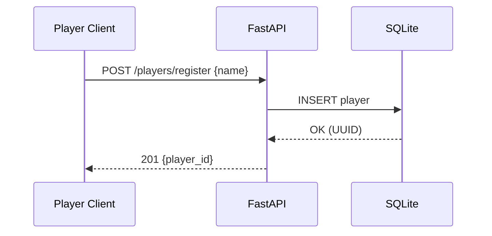
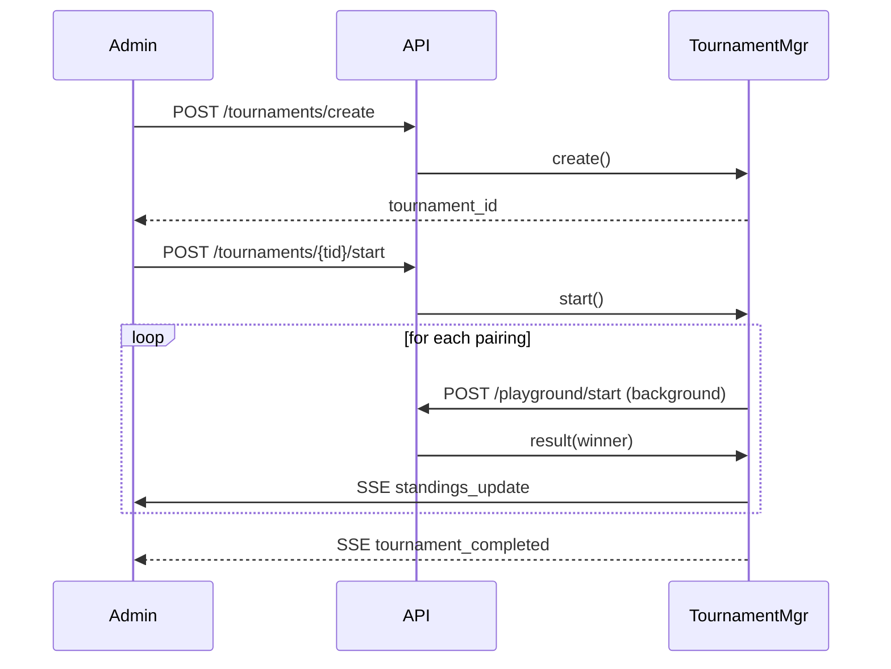

# SWEX‑Camp 2025 Hackathon — Backend Specification

*Version 1.0 (27 Jul 2025)*

---

## 1  Scope & Overview

|               | **Playground** (ad‑hoc PvP / PvE)  | **Tournament** (single round‑robin) |
| ------------- | ---------------------------------- | ----------------------------------- |
| Primary users | Players, Administrator             | Players, Administrator              |
| Transport     | REST + JSON · Server‑Sent Events   | Same as Playground                  |
| Runtime       | **Python 3.10+** · FastAPI · async | Same instance / codebase            |
| Sandbox       | RestrictedPython · 100 ms CPU/bot  | Same                                |
| Persistence   | **SQLite** (file) via SQLModel     | Shared                              |

---

## 2  API Surface

### 2.1 Players

| Verb     | Path                   | Purpose                                                 |
| -------- | ---------------------- | ------------------------------------------------------- |
| **POST** | `/players/register`    | Register `player_name` → returns `{ player_id }` (UUID) |
| **GET**  | `/players/{player_id}` | Retrieve player metadata (stats & profile)              |
| **GET**  | `/admin/players`       | List all registered players *(open endpoint; no auth)*  |

### 2.2 Bot Management

| Verb     | Path                | Purpose                                        |
| -------- | ------------------- | ---------------------------------------------- |
| **POST** | `/bots/submit`      | Upload / overwrite a player’s bot source code  |
| **GET**  | `/bots/{player_id}` | Download the latest bot source for that player |
| **GET**  | `/bots/builtin`     | List hard‑coded sample bots                    |

> **Built‑in bots** (IDs are fixed constants):
>
> 1. **Sample Bot 1** (id `1`)
> 2. **Sample Bot 2** (id `2`)
> 3. **Sample Bot 3** (id `3`)

### 2.3 Playground Sessions

| Verb       | Path                              | Notes                                                                         |
| ---------- | --------------------------------- | ----------------------------------------------------------------------------- |
| **POST**   | `/playground/start`               | Body `{ player_1_id, player_2_id \| builtin_id }` → `{ session_id, sse_url }` |
| **GET**    | `/playground/{session_id}/events` | SSE stream: `turn`, `game_over`                                               |
| **POST**   | `/playground/{session_id}/action` | Submit player action for current turn                                         |
| **GET**    | `/playground/{session_id}/replay` | Fetch JSON replay (while retained in memory)                                  |
| **DELETE** | `/playground/{session_id}`        | Admin cleanup (no auth)                                                       |
| **GET**    | `/playground/active`              | List live sessions                                                            |

### 2.4 Tournament End‑points

| Verb     | Path                        | Purpose                                                                                 |
| -------- | --------------------------- | --------------------------------------------------------------------------------------- |
| **POST** | `/tournaments/create`       | `{ name, player_ids[], rules:{ max_turns } }` → `tournament_id`                         |
| **POST** | `/tournaments/{tid}/start`  | Generate full **single** round‑robin schedule and begin sequential execution            |
| **GET**  | `/tournaments/{tid}/status` | Live standings & upcoming match info                                                    |
| **GET**  | `/tournaments/{tid}/events` | SSE feed: `match_started`, `match_finished`, `standings_update`, `tournament_completed` |
| **POST** | `/tournaments/{tid}/abort`  | Hard‑stop tournament & persist current results                                          |

---

## 3  Data Models (SQLModel / Pydantic)

```python
class Player(SQLModel, table=True):
    player_id: UUID = Field(default_factory=uuid4, primary_key=True)
    player_name: str
    submitted_from: str | None = None  # ip / user‑agent
    wins: int = 0
    draws: int = 0
    losses: int = 0
    total_matches: int = 0
```

```python
class SessionState(BaseModel):
    session_id: str
    player_1_id: str
    player_2_id: str
    current_game_state: dict
    match_log: list[str]
    turn_index: int = 0
    awaiting_actions: dict[str, BotAction] = {}
```

```python
class Tournament(SQLModel, table=True):
    tournament_id: UUID = Field(default_factory=uuid4, primary_key=True)
    name: str
    created_at: datetime
    max_turns: int
    current_match_index: int = 0  # sequential execution
    standings: dict[str, int] = {}  # player_id -> points
```

*Points system*: **win = 3**, **draw = 1**, **loss = 0**. Tie‑breakers: ① head‑to‑head result → ② higher win count → ③ coin‑flip.

---

## 4  Execution & Concurrency

- One `asyncio.Task` per **Playground** session and one background task running the sequential **TournamentManager**.
- Bot `decide()` executed in `asyncio.to_thread` with **100 ms** wall‑time cap; if exceeded, bot forfeits the turn.
- Environment variables:
  - `TURN_DELAY_SECONDS` (default `0.3`)
  - `TURN_TIMEOUT_SECONDS` (default `1.0`)
  - `MAX_TURNS` (session level; overridable via tournament `rules.max_turns`).

---

## 5  Game Loop (Pseudo‑code)

```python
while not game_over and turn_index < MAX_TURNS:
    await collect_actions_or_timeout()
    state, events = engine.apply_turn(state, awaiting_actions)
    broadcast_sse("turn", state, events)
    awaiting_actions.clear()
    turn_index += 1
    await asyncio.sleep(TURN_DELAY_SECONDS)

if game_over or turn_index == MAX_TURNS:
    broadcast_sse("game_over", summary)
    update_stats()
    persist_log()
```

---

## 6  Security & Resource Limits

- **Sandbox** : RestrictedPython with safe‑builtins; file‑system & network imports blocked.
- **No authentication** for hackathon scope (including admin‑prefixed routes).
- **No rate limits** for `/action` in this release; revisit if abuse observed.

---

## 7  Testing Matrix

| Layer           | Scenarios                                                             |
| --------------- | --------------------------------------------------------------------- |
| **Unit**        | Bot safety, timeout, stat updates, tie‑break functions                |
| **Integration** | PvE, PvP, SSE reconnect, replay availability/expiry                   |
| **Load**        | ≥ 20 concurrent Playground sessions without event‑loop starvation     |
| **Tournament**  | Full single round‑robin with 4–16 players; verify points and ordering |

---

## 8  Interaction Diagrams

### 8.1 Player Registration



### 8.2 Playground Match (ad‑hoc)

```mermaid
sequenceDiagram
participant P1
participant P2/Bot
participant API
participant Loop as SessionLoop
P1->>API: POST /playground/start
API->>Loop: init session
Loop-->>P1: session_id
P1->>API: GET /.../events (SSE)
loop each turn
    P1->>API: POST /action
    Loop->>P2/Bot: decide()
    Loop->>Loop: apply_turn()
    Loop->>P1&P2: SSE turn
end
Loop->>P1&P2: SSE game_over
```

### 8.3 Tournament (single round‑robin, sequential)



---

## 9  Implementation Choices

| Concern           | Recommendation                                 |
| ----------------- | ---------------------------------------------- |
| **DB**            | SQLModel + SQLite (`sqlite:///./hackathon.db`) |
| **Web framework** | FastAPI + Uvicorn                              |
| **SSE helper**    | `sse-starlette`                                |
| **Logging**       | `structlog` → rotate to `./logs/`              |
| **Container**     | Single Dockerfile (python 3.10‑slim)           |
| **CI**            | GitHub Actions · pytest · mypy                 |

---

## 10  Decisions & Assumptions

1. **Tournament format**: single round‑robin; sequential execution.
2. **Scoring**: win = 3, draw = 1, loss = 0; tie‑breakers: head‑to‑head → wins → random.
3. **No authentication** for any endpoints in MVP.
4. **Built‑in bots**: 3 hard‑coded samples (`1`, `2`, `3`).
5. **Rate limiting**: none for MVP.
6. **Storage**: SQLite file is sufficient for November demo; swap to Postgres if scale requires.

---

*End of specification*

